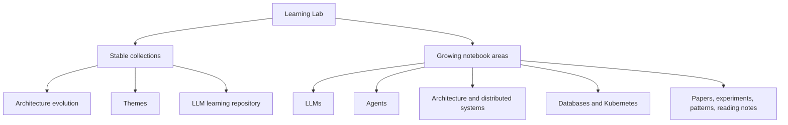

# Learning Lab

`learning-lab` is a reusable engineering notebook for concepts, papers, experiments, patterns, and methodical learning paths. Material here is customer-neutral and designed to be improved over time.

## Current collections

| Collection | Purpose |
|---|---|
| [Architecture evolution](architecture-evolution/README.md) | Evidence-led architecture decisions, quality attributes, trade-offs, and an interactive blueprint |
| [Themes](themes/) | Reusable guidance for agentic engineering, analytics, context, orchestration, RAG, channels, and memory |
| [LLM learning repository](llm-learning-repository/README.md) | Ordered papers, local PDFs, three-level tutorials, a research roadmap, and weekly arXiv curation |

## Notebook areas

The existing collections remain stable at the repository root. Broader areas provide navigation and can grow independently as relevant material is added.

| Area | Current entry point |
|---|---|
| [LLMs](llms/README.md) | Models, retrieval, evaluation, and curriculum material |
| [Agents](agents/README.md) | Agentic engineering and multi-agent systems |
| [Architecture](architecture/README.md) | Architecture evolution and decision methods |
| [Distributed systems](distributed-systems/README.md) | Coordination, reliability, consistency, and failure handling |
| [Databases](databases/README.md) | Data architecture and storage learning |
| [Kubernetes](kubernetes/README.md) | Container orchestration learning |
| [Papers](papers/README.md) | Paper collections and manifests |
| [Experiments](experiments/README.md) | Reproducible prototypes and evaluations |
| [Patterns](patterns/README.md) | Reusable engineering patterns |
| [Reading notes](reading-notes/README.md) | Guided notes and learning plans |

## Contribution model

1. Add material to an existing collection when it naturally belongs there.
2. Add a new top-level collection only when it has a durable purpose and more than one likely artifact.
3. Keep papers, experiments, and conclusions versioned together.
4. Mark assumptions, evidence, uncertainty, and external links clearly.
5. Prefer reproducible examples and human-reviewed automation.

Customer-specific objectives, policies, data, and implementation details belong in their delivery repository. Learning Lab may link to sanitized examples but must not contain customer-sensitive information.
