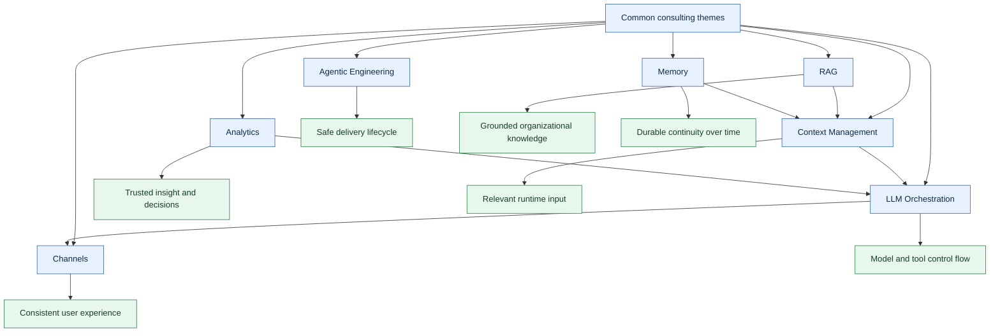

# Common Consulting Content

## Purpose

This area contains customer-neutral guidance that can be reused across consulting engagements. Customer folders should adapt these themes to their domain, constraints, technology estate, users, and delivery maturity instead of redefining the underlying concepts.

## Content model

## Themes

| Theme | Core question | Typical outputs |
|---|---|---|
| [Agentic Engineering](themes/agentic-engineering/README.md) | How do teams safely build and maintain software with AI agents? | Workflow, repository conventions, controls, evaluation, adoption plan |
| [Analytics](themes/analytics/README.md) | How do data become trusted measures and decisions? | Data architecture, metric catalogue, semantic model, dashboards |
| [Context Management](themes/context-management/README.md) | What information should an AI system receive for this task? | Context sources, selection rules, budgets, security boundaries |
| [LLM Orchestration](themes/llm-orchestration/README.md) | How are models, tools, agents, and deterministic services coordinated? | Control flow, routing, tool contracts, failure handling, traces |
| [RAG](themes/rag/README.md) | How does an AI system retrieve and cite authoritative knowledge? | Corpus design, ingestion, retrieval, grounding, evaluation |
| [Channels](themes/channels/README.md) | How is one capability delivered consistently across user touchpoints? | Channel adapters, identity model, interaction policy, hand-off design |
| [Memory](themes/memory/README.md) | What should persist across interactions, for whom, and for how long? | Memory taxonomy, lifecycle, consent, retention, quality controls |

## Cross-cutting method

- [Architecture Evolution and Decision Making](architecture-evolution/README.md): a data-driven method for evolving architecture through measurable quality-attribute scenarios, evidence-backed technology gates, trade-off scoring, decisions, and operational feedback. It includes an [interactive generic application blueprint](architecture-evolution/blueprint/README.md).
- [LLM Learning Repository](llm-learning-repository/README.md): an ordered collection of primary papers, local PDFs, diagrams, and three-level tutorials that progress from intuition through implementation to research practice.

## How to use this area

1. Start with the theme pages relevant to the engagement outcome.
2. Record customer-specific constraints and decisions in the customer folder.
3. Link to common guidance instead of copying it into every engagement.
4. Promote improvements back into `common` only when they are broadly reusable and free of customer-sensitive information.
5. Keep customer examples clearly labelled; examples are evidence, not universal defaults.

## Reuse boundary

Belongs in `common`:

- Vendor-neutral concepts, decision frameworks, checklists, templates, and evaluation methods.
- Repeatable delivery practices and architectural patterns.
- Sanitized examples that do not expose customer data or internal details.

Belongs in a customer folder:

- Customer objectives, personas, policies, data classifications, and acceptance criteria.
- Selected products, deployment topology, integration details, and operating procedures.
- Customer-specific risks, metrics, prototypes, meeting outputs, and decisions.

## Current reference engagement

The [Arghyam engagement](../2026/2026-08-Arghyam-1/README.md) contains the first concrete applications of several themes. Its documents and prototype are linked from the individual theme pages as examples, not as dependencies of the common guidance.
