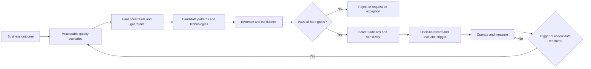

# Architecture Evolution and Decision Making

## Purpose

Architecture should evolve in response to evidence, not fashion, vendor preference, or unmeasured expectations about future scale. This method turns business outcomes and quality attributes into measurable scenarios, evaluates technology options against evidence, records trade-offs, and revisits decisions when the operating context changes.

The method is customer-neutral. Each engagement supplies its own workloads, constraints, measurements, approved technologies, costs, risks, and decision authority.

## Assets

- [Decision method](decision-method.md): the repeatable process, evidence model, scoring model, and governance cycle.
- [Interactive architecture blueprint](blueprint/README.md): a clickable generic application architecture with scale, reliability, and latency filters.
- [Blueprint application](blueprint/index.html): the standalone interactive view.
- [GitHub Pages deployment target](https://niyama-admin.github.io/consulting/): becomes available after Pages is enabled and the workflow is deployed from the default branch.

## Method at a glance

## Core principles

1. **Start with scenarios, not products.** Express scale, reliability, latency, security, operability, cost, and changeability as measurable workload scenarios.
2. **Separate gates from preferences.** Regulatory, compatibility, reliability, residency, and performance minima are pass/fail. Cost, familiarity, flexibility, and delivery speed can be weighted trade-offs.
3. **Score evidence, not confidence theatre.** Every material claim needs a source, date, workload context, owner, and confidence level.
4. **Model more than the happy path.** Evaluate peak load, failure, recovery, dependency degradation, data growth, migration, and operator intervention.
5. **Prefer reversible decisions.** Delay irreversible commitments until evidence justifies them; define seams and exit paths for expensive-to-reverse choices.
6. **Record why and when to reconsider.** Every decision includes rejected options, assumptions, consequences, expiry or review date, and observable evolution triggers.
7. **Close the loop with production data.** Replace estimates with operational evidence and reopen decisions when thresholds are crossed.

## Relationship to the consulting themes

The method applies across all themes:

- Agentic Engineering supplies the delivery and validation workflow.
- Analytics supplies trustworthy operational and business measurements.
- Context Management, RAG, and Memory introduce quality, privacy, freshness, and cost scenarios.
- LLM Orchestration introduces probabilistic quality, tool reliability, and model-routing decisions.
- Channels introduce reach, accessibility, identity, availability, and response-time constraints.

## Status

This is an initial framework and seed catalog. Thresholds in the interactive blueprint are illustrative capability bands, not procurement recommendations. Customer use requires calibration with real traffic distributions, service-level objectives, benchmark results, commercial terms, team capability, security policy, and vendor evidence.
