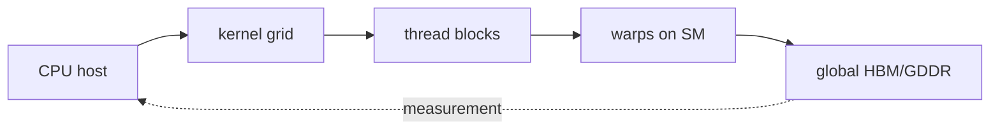

# NVIDIA GPUs through the CUDA Programming Guide

> **Primary sources:** NVIDIA CUDA Programming Guide Release 13.x
>
> This chapter is a first-reading replacement, not an instruction-list replacement. Follow live specifications for normative details and use the local PDFs for stable study.

## Paper and specification at a glance

| Lens | Answer |
|---|---|
| Guiding question | How do CUDA's grid, block, warp, and memory abstractions map to NVIDIA hardware? |
| Core model | A kernel launch creates a grid of blocks. A block is scheduled onto one streaming multiprocessor and is divided into 32-thread warps. Threads have registers; a block has shared memory; all threads can access global memory. Occupancy depends on registers, shared memory, threads, and architectural limits. Coalesced accesses combine nearby lane requests; divergence serializes paths within a warp. |
| Critical comparison | CUDA specifies a programming model across NVIDIA generations. Compute capability identifies feature sets and limits, while exact cache geometry and instruction behavior may differ. Unified memory is managed accessibility, not a promise that CPU and GPU access the same physical location at equal cost. |
| Formal lens | For a block using R registers/thread, S bytes shared/block, and B threads, resident blocks are bounded by min(register_file/(RB), shared_capacity/S, thread_limit/B, block_limit). The tightest resource determines occupancy. |
| Practical lab | Write tiled matrix multiplication after a correct naive version. Measure global-load efficiency, occupancy, and time; change tile size one variable at a time and verify numerical error. |

## Concept map

The diagram is a chain of contracts. Each arrow can preserve correctness while changing cost. Never infer a microarchitectural structure solely from an API name, and never infer performance solely from an ISA feature.

## Tutorial 1 - Intuitive understanding

+Think of a dispatcher sends independent crews to workshops; workers in each crew move in squads and share one workbench. How do CUDA's grid, block, warp, and memory abstractions map to NVIDIA hardware?

A kernel launch creates a grid of blocks. A block is scheduled onto one streaming multiprocessor and is divided into 32-thread warps. Threads have registers; a block has shared memory; all threads can access global memory. Occupancy depends on registers, shared memory, threads, and architectural limits. Coalesced accesses combine nearby lane requests; divergence serializes paths within a warp.

Walk through CPU host -> kernel grid -> thread blocks -> warps on SM -> global HBM/GDDR. At the first stage, software expresses work. Intermediate stages translate, schedule, store, or move it. The final stage is observable only through architectural results and measurements. A faster middle stage may not improve the whole path when data movement or serialization dominates.

CUDA specifies a programming model across NVIDIA generations. Compute capability identifies feature sets and limits, while exact cache geometry and instruction behavior may differ. Unified memory is managed accessibility, not a promise that CPU and GPU access the same physical location at equal cost.

Three traps matter. First, “core” means different things across vendors. Second, shared address space does not imply shared physical memory or equal access time. Third, a headline peak assumes enough independent work, favorable types, and sustained data supply. The teach-back test is to explain the diagram without using “the GPU is just faster” or “Arm is low power.”

## Tutorial 2 - Practitioner understanding

A kernel launch creates a grid of blocks. A block is scheduled onto one streaming multiprocessor and is divided into 32-thread warps. Threads have registers; a block has shared memory; all threads can access global memory. Occupancy depends on registers, shared memory, threads, and architectural limits. Coalesced accesses combine nearby lane requests; divergence serializes paths within a warp.

### From source to machine behavior

At every boundary record inputs, outputs, ownership, ordering, and cost. Compilers may vectorize, fuse, reorder, or eliminate work. Drivers and runtimes may queue asynchronously. Hardware may cache, speculate, coalesce, or migrate data while preserving its contract. Therefore profile the executed artifact, not the source code you intended.

### Performance model

For a block using R registers/thread, S bytes shared/block, and B threads, resident blocks are bounded by min(register_file/(RB), shared_capacity/S, thread_limit/B, block_limit). The tightest resource determines occupancy.

Use units throughout. Convert bytes and operations consistently, distinguish decimal GB from binary GiB, and separate elapsed time from device-only time. Check numerical results after every optimization. For concurrent code, use language/runtime synchronization rather than a timing delay. For accelerator code, synchronize only where required, but include required synchronization in end-to-end measurements.

### Build and measurement lab

Write tiled matrix multiplication after a correct naive version. Measure global-load efficiency, occupancy, and time; change tile size one variable at a time and verify numerical error.

Required artifact: source, compiler command, generated-code excerpt, hardware/driver inventory, raw timing rows, summary with uncertainty, correctness check, and a short explanation of one rejected hypothesis. Acceptance means another practitioner can reproduce the shape of the result and tell which claims are specification-backed versus inferred.

## Tutorial 3 - Researcher understanding

For a block using R registers/thread, S bytes shared/block, and B threads, resident blocks are bounded by min(register_file/(RB), shared_capacity/S, thread_limit/B, block_limit). The tightest resource determines occupancy.

### Reading normative documentation

Read “must,” “shall,” “may,” implementation-defined, and undefined literally. Identify the architecture/version and execution mode. Separate functional semantics from performance advice. Specifications often describe an abstract machine; implementations may reorder internally so long as prohibited observations never become visible. Programming models add another abstract machine whose compiler mapping must be justified.

### Reconstructing evidence

CUDA specifies a programming model across NVIDIA generations. Compute capability identifies feature sets and limits, while exact cache geometry and instruction behavior may differ. Unified memory is managed accessibility, not a promise that CPU and GPU access the same physical location at equal cost.

For each reported number, record device, revision, clock/power state, operand types, instruction mix, working-set size, layout, compiler, repetitions, estimator, and whether transfers or launch are included. Reproduce a baseline before the claimed mechanism. Use dependent operations for latency and independent operations for throughput. Inspect machine code so compiler behavior is not the hidden treatment.

### Threats to validity and extensions

Internal threats include timer overhead, dead-code elimination, unreported throttling, cache warm state, asynchronous completion, occupancy differences, and counter multiplexing. External threats include a new generation, different driver/compiler, integrated versus discrete memory, virtualization, and workload structure. Construct an extension with competing hypotheses whose predicted curves differ; a single faster/slower number rarely identifies a mechanism.

### Close-reading station 1: CPU host

Locate how the source defines **CPU host**. Record whether it is guaranteed by an ISA/programming specification, described for one microarchitecture, or inferred experimentally. Connect it to the adjacent stages in CPU host -> kernel grid -> thread blocks -> warps on SM -> global HBM/GDDR. Then write one correctness test and one performance test. The correctness test must avoid timing assumptions; the performance test must record configuration and uncertainty.

### Close-reading station 2: kernel grid

Locate how the source defines **kernel grid**. Record whether it is guaranteed by an ISA/programming specification, described for one microarchitecture, or inferred experimentally. Connect it to the adjacent stages in CPU host -> kernel grid -> thread blocks -> warps on SM -> global HBM/GDDR. Then write one correctness test and one performance test. The correctness test must avoid timing assumptions; the performance test must record configuration and uncertainty.

### Close-reading station 3: thread blocks

Locate how the source defines **thread blocks**. Record whether it is guaranteed by an ISA/programming specification, described for one microarchitecture, or inferred experimentally. Connect it to the adjacent stages in CPU host -> kernel grid -> thread blocks -> warps on SM -> global HBM/GDDR. Then write one correctness test and one performance test. The correctness test must avoid timing assumptions; the performance test must record configuration and uncertainty.

### Close-reading station 4: warps on SM

Locate how the source defines **warps on SM**. Record whether it is guaranteed by an ISA/programming specification, described for one microarchitecture, or inferred experimentally. Connect it to the adjacent stages in CPU host -> kernel grid -> thread blocks -> warps on SM -> global HBM/GDDR. Then write one correctness test and one performance test. The correctness test must avoid timing assumptions; the performance test must record configuration and uncertainty.

### Close-reading station 5: global HBM/GDDR

Locate how the source defines **global HBM/GDDR**. Record whether it is guaranteed by an ISA/programming specification, described for one microarchitecture, or inferred experimentally. Connect it to the adjacent stages in CPU host -> kernel grid -> thread blocks -> warps on SM -> global HBM/GDDR. Then write one correctness test and one performance test. The correctness test must avoid timing assumptions; the performance test must record configuration and uncertainty.

## Appendix - Prerequisites

### Prerequisite 1 - Binary, instructions, and state

Bits acquire meaning through a contract. The same 64-bit pattern may be an integer, floating-point value, address, or instruction encoding. An instruction names an operation and operands; architectural state includes registers, memory, status, and control state visible to software. Endianness orders bytes in multi-byte values but does not reverse bits inside every byte. Practice by encoding 13 as unsigned binary, signed two's complement, and an address; the representation and permitted operations differ even when a debugger prints similar digits.

**References:** Patterson and Hennessy, *Computer Organization and Design*; Bryant and O'Hallaron, *Computer Systems: A Programmer's Perspective*.

### Prerequisite 2 - Locality, caches, and virtual memory

Temporal locality means recently used data may be reused; spatial locality means nearby addresses may be used. Caches move fixed-size lines and identify them with tags. Virtual memory divides addresses into pages; a TLB caches translations, while page tables define mappings and permissions. A cache miss and a page fault are radically different events. CPU/GPU managed memory adds placement and migration decisions on top of address translation. Work a 4 KiB-page example: offset bits select a byte within the page; remaining virtual bits identify the page and are translated before physical cache/DRAM access according to the implementation.

**References:** Bryant and O'Hallaron, *Computer Systems: A Programmer's Perspective*; Intel and AMD architecture manuals; Arm Architecture Reference Manual.

### Prerequisite 3 - Parallelism and synchronization

Instruction-level parallelism overlaps independent operations in one thread. Data parallelism applies one operation across elements. Thread parallelism runs independent instruction streams. Synchronization establishes ordering and visibility; it is not merely “waiting.” Atomics provide indivisible operations with specified ordering. A barrier normally coordinates a defined group, not every thread in a system. Draw a dependency graph before parallelizing: nodes are operations, edges are required order. The longest dependency chain limits latency even with unlimited workers.

**References:** Hennessy and Patterson, *Computer Architecture: A Quantitative Approach*; Herlihy and Shavit, *The Art of Multiprocessor Programming*.

### Prerequisite 4 - Performance measurement and uncertainty

Latency is time per operation; throughput is operations per time. Bandwidth is bytes per time. FLOPS counts floating-point operations under a convention and says nothing about correctness. Warm-up, clocks, power limits, NUMA placement, compiler transformations, caching, asynchronous APIs, and timer placement change results. Report distributions and configurations. A confidence interval cannot repair a biased benchmark. Validate output, synchronize at measurement boundaries, inspect generated code, and test multiple sizes.

**References:** Hennessy and Patterson, *Computer Architecture: A Quantitative Approach*; Lilja, *Measuring Computer Performance*.

### Prerequisite 5 - Floating point, vectors, and matrices

IEEE 754 floating point trades exactness for range. Addition is not associative, so parallel reductions can produce different low bits. SIMD/SIMT lanes perform related operations; matrix engines accelerate structured multiply-accumulate tiles at selected precisions. Peak “operations” often counts one multiply-add as two. Before comparing hardware, align data type, sparsity assumptions, accumulation type, error tolerance, and counting convention.

**References:** IEEE 754; Higham, *Accuracy and Stability of Numerical Algorithms*; NVIDIA, AMD, and Intel programming guides.

### Prerequisite 6 - Specifications versus measurements

An architecture specification defines permitted observable behavior. A vendor optimization guide describes expected implementation behavior but may be conditional. A whitepaper selects explanatory and marketing details. A research paper supplies a method and evidence with bounded validity. A microbenchmark infers hidden structure. Maintain separate columns for guaranteed, documented recommendation, reported product fact, and experimental inference. This prevents code from depending accidentally on a cache size, warp-synchronous behavior, or ordering rule that was never guaranteed.

**References:** AMD64 and Intel software developer manuals; Arm Architecture Reference Manual; CUDA, HIP, and oneAPI programming guides.

## Glossary

- **ISA:** software-visible machine contract.
- **Microarchitecture:** a hardware implementation of an ISA or execution model.
- **ABI:** conventions allowing separately compiled software to interoperate.
- **SIMD:** one instruction operates across explicit vector lanes.
- **SIMT:** threads are programmed individually but scheduled in groups.
- **Coherence:** rules keeping cached copies of a location consistent.
- **Consistency model:** permitted ordering/visibility of memory operations.
- **Occupancy:** resident parallel groups relative to an architectural maximum.
- **Arithmetic intensity:** operations performed per byte moved.
- **Roofline:** upper-bound model combining compute and bandwidth ceilings.

## Checkpoint

- **Intuition:** explain the analogy, the five-stage map, and two cases where a headline comparison fails.
- **Practitioner:** complete the lab with correct results, full timing boundaries, generated-code inspection, and a reproducible environment.
- **Researcher:** classify every claim as normative, documented, product-specific, or inferred; reconstruct one model; and design a controlled falsification experiment.
