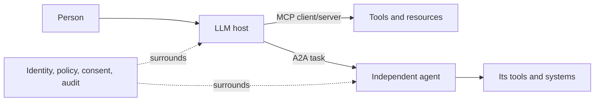

# MCP, A2A, and communication channels

Protocol specifications change faster than papers. Read the interoperability survey first, then use the official specifications as the source of truth:

- MCP specification: https://modelcontextprotocol.io/specification/
- A2A project and specification: https://a2a-protocol.org/
- JSON-RPC 2.0: https://www.jsonrpc.org/specification
- OAuth 2.1 draft/status: https://oauth.net/2.1/

## The boundary map

A **channel** has two common meanings in an LLM system:

1. A **system channel** is a governed path for messages. A shared transcript, private specialist message, tool result, event stream, and human approval queue are different channels even when all carry JSON.
2. A **delivery channel** is where a person encounters the capability: web, mobile, email, chat, voice, an IDE, or an API. These should share policy and core behavior but adapt identity, latency, formatting, accessibility, and hand-off to the setting.

For every system channel, specify sender, receiver, schema, ordering, persistence, authentication, authorization, confidentiality, retry rules, timeout, maximum size, and human visibility. For every delivery channel, specify user identity, supported actions, consent, notification behavior, escalation, response-time expectation, and what happens when the channel cannot safely render or confirm an action.

Never treat protocol compatibility as trust. Validate inputs and outputs, use least privilege, bind approvals to exact actions, prevent confused-deputy behavior, redact secrets from traces, and test replay, injection, impersonation, and partial-failure scenarios.
