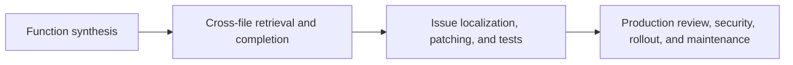

# Repository and source-control benchmark field guide

"Can it write code?" hides several different capabilities. Use the benchmark that matches the job.

| Benchmark | Unit of work | Context | Success signal | What it misses |
|---|---|---|---|---|
| HumanEval | one function | prompt, usually one file | hidden unit tests; pass@k | navigation, cross-file design, maintenance |
| RepoBench | retrieval and next-line completion | multiple repository files | retrieval/completion metrics | end-to-end issue resolution |
| SWE-bench | real issue and repository snapshot | codebase, issue text, execution environment | tests against a generated patch | many product, security, review, and long-term maintainability concerns |

## Reproducible source-control setup

Pin the repository commit, benchmark version, container image digest, dependencies, tests, prompt, model identifier, sampling settings, tool permissions, retry budget, and agent framework. Save the final patch and the complete trajectory. A benchmark result without the exact harness is not a reproducible result.

## Metrics beyond pass/fail

- Localization recall: did the system inspect the relevant files?
- Patch scope: how much unrelated code changed?
- Regression and hidden-test outcomes.
- Attempts, tokens, wall time, compute, and monetary cost.
- Unsafe commands or forbidden access attempts.
- Human review time and correction size.
- Failure recovery after a broken test, tool timeout, or misleading issue description.

Always compare a coding agent with a simpler baseline: retrieval plus one model call, or a human with ordinary IDE tools. Agent scaffolding is part of the evaluated system and must be versioned.
