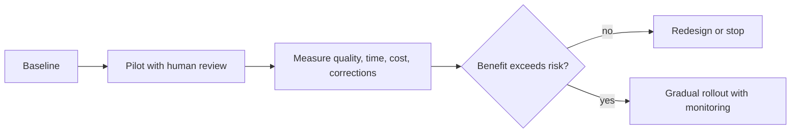

# Evidence-led small-business adoption playbook

Start with a frequent, text-heavy, reversible task whose quality can be reviewed: support drafting, proposal first drafts, meeting summaries, approved-document search, or structured intake. Avoid autonomous financial, legal, employment, or customer-impacting actions until governance and domain review are mature.

For professional writing evidence beyond the downloaded arXiv set, read Noy and Zhang's *Experimental Evidence on the Productivity Effects of Generative Artificial Intelligence*: https://economics.mit.edu/sites/default/files/inline-files/Noy_Zhang_1_0.pdf. It is a useful randomized study, but its bounded writing tasks still require an external-validity check before application to a particular firm.

For each pilot, predefine the user group, comparison condition, primary outcome, quality rubric, privacy boundary, budget, rollback, and stop criteria. Track total work: prompting, review, correction, escalation, and maintenance. Segment results by task and worker experience; averages can conceal who benefits or is harmed.
