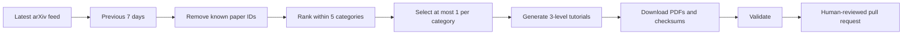

# Weekly curation workflow

Every Saturday at 09:00 Asia/Kolkata, GitHub Actions runs the weekly updater against `main`.



## Weekly categories and days

- Monday: foundations and architecture.
- Tuesday: building, RAG, reasoning, alignment, and adaptation.
- Wednesday: evaluation and source-code benchmarks.
- Thursday: agents, swarms, MCP/A2A, protocols, and channels.
- Friday: small-business applications and human productivity.

If no qualifying paper exists for a category, that day becomes a catch-up, reproduction, and note-review day. The updater never fills a slot with an irrelevant paper merely to reach five.

## Selection policy

The workflow requests up to 300 recent records in `cs.CL`, `cs.AI`, `cs.LG`, `cs.SE`, `cs.MA`, and `cs.HC`, filters to the previous seven days, removes IDs already present in the core manifest or weekly metadata, and ranks title/abstract matches plus subject fit and recency. One unique paper is selected per category. Scores express relevance to this curriculum, not scientific quality.

## Summary modes

The updater extracts the downloaded PDF with Poppler and calls normal DigitalOcean Serverless Inference at `https://inference.do-ai.run/v1/responses`. The model receives paper text selected across the introduction, methods, evaluation, results, limitations, and appendices, then authors three self-contained tutorials and paper-specific prerequisite appendices. Set `DIGITALOCEAN_MODEL_ID` to a serverless model ID from the DigitalOcean Model Catalog; the workflow defaults to `openai-gpt-5.5`. It does not create or invoke a DigitalOcean agent or dedicated inference deployment. Scheduled production runs fail instead of opening a PR when full-paper authoring or quality checks fail.

Create the model access key in DigitalOcean, then add it only as the `MODEL_ACCESS_KEY` secret in the GitHub `production` environment. Add `DIGITALOCEAN_MODEL_ID` as an optional variable in the same environment. Do not commit the key or place it in workflow inputs. All model inference for this workflow is billed through DigitalOcean.

Generated text must be checked against the PDF before merge. The workflow opens or refreshes a PR and never auto-merges.

## Repository settings

GitHub Actions must be allowed to create pull requests under **Settings → Actions → General → Workflow permissions**. The workflow requests only `contents: write` and `pull-requests: write`, and the curation job is bound to the `production` environment. Environment protection rules can require reviewers before the weekly job receives its model key.

## Manual operation

From `llm-learning-repository` in the common repository:

```text
node weekly-update.mjs --self-test
node weekly-update.mjs --week-ending=2026-08-29 --dry-run
node weekly-update.mjs --week-ending=2026-08-29
node weekly-update.mjs --verify
```

Use the workflow's manual-dispatch input to backfill a particular UTC week-ending date. Re-running the same date is idempotent because recorded arXiv IDs are excluded.
