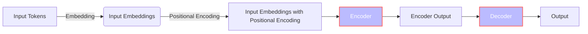

# Attention Is All You Need - Complete Tutorial

## Paper at a glance

| Category | Description | 
| --- | --- |
| Research Question | Can a model relying entirely on attention mechanisms improve sequence transduction tasks such as machine translation? |
| Prior Problem | Traditional sequence transduction models rely on complex recurrent or convolutional neural networks, which are inherently sequential and limit parallelization. |
| Central Contribution | The Transformer, a novel model architecture based solely on attention mechanisms, dispensing with recurrence and convolutions entirely. |
| Method | The Transformer uses stacked self-attention and point-wise, fully connected layers for both the encoder and decoder. |
| Headline Findings | The Transformer achieves state-of-the-art results in machine translation tasks (28.4 BLEU on WMT 2014 English-to-German and 41.8 BLEU on WMT 2014 English-to-French) while being more parallelizable and requiring significantly less training time (3.5 days on 8 GPUs for the big model). |
| Scope | The paper focuses on sequence transduction tasks, particularly machine translation, and demonstrates the Transformer's potential for other tasks like English constituency parsing. |

The paper mattered at publication time because it introduced a novel architecture that significantly improved the state-of-the-art in machine translation while reducing training time, making it a more efficient and effective solution.

## Concept map

```mermaid
graph LR;
    A[Input Sequence] --> B[Encoder];
    B --> C[Self-Attention Layers];
    C --> D[Feed-Forward Network];
    D --> E[Encoder Output];
    E --> F[Decoder];
    F --> G[Self-Attention Layers];
    G --> H[Encoder-Decoder Attention];
    H --> I[Feed-Forward Network];
    I --> J[Output Sequence];
```

The diagram illustrates the Transformer's architecture. The input sequence is fed into the encoder, which consists of self-attention layers and a feed-forward network. The encoder's output is then passed to the decoder, which also comprises self-attention layers, encoder-decoder attention, and a feed-forward network, ultimately generating the output sequence.

## Tutorial 1 - Intuitive understanding

Imagine you're trying to translate a sentence from one language to another. Traditional translation models would process the input sentence word by word, using recurrent neural networks to capture the context. However, this sequential processing limits parallelization and can be time-consuming.

The Transformer revolutionizes this process by abandoning recurrent neural networks and relying solely on attention mechanisms. Think of attention as a spotlight that highlights specific parts of the input sentence when generating each word of the output sentence.

Here's a step-by-step walkthrough:

1. The input sentence is broken down into individual words or tokens, and each token is embedded into a vector representation.
2. The encoder takes these vector representations and applies self-attention, allowing it to weigh the importance of each token relative to others in the sentence.
3. The self-attention mechanism is applied multiple times in parallel, with different "heads" focusing on different aspects of the sentence.
4. The output from the self-attention layers is then passed through a feed-forward network, which transforms the representations.
5. The decoder follows a similar process, but with an additional encoder-decoder attention mechanism that allows it to focus on relevant parts of the input sentence when generating each output word.

The analogy breaks when considering the complexity of the self-attention mechanism and the multiple layers involved. While the spotlight analogy helps understand the basic concept, the actual implementation involves sophisticated mathematical operations and multiple layers.

### What the experiments show - and do not show

The experiments demonstrate the Transformer's superiority over previous state-of-the-art models in machine translation tasks, achieving higher BLEU scores (28.4 on WMT 2014 English-to-German and 41.8 on WMT 2014 English-to-French) while requiring significantly less training time.

The results also show that the Transformer generalizes well to other tasks, such as English constituency parsing, achieving competitive results.

However, the experiments do not show:

* The Transformer's performance on tasks involving input and output modalities other than text.
* The effectiveness of the Transformer on very long sequences, although the paper mentions that restricting self-attention to a neighborhood of size r could be a potential solution.

Teach-back recap: The Transformer is a novel model architecture that relies entirely on attention mechanisms, achieving state-of-the-art results in machine translation tasks while being more parallelizable and efficient. Its performance on other tasks, such as English constituency parsing, is also promising. However, further research is needed to explore its limitations and potential applications beyond text-based tasks.

## Tutorial 2 - Practitioner understanding
The Transformer is a neural network architecture introduced by Vaswani et al. for sequence transduction tasks, primarily machine translation. It replaces traditional recurrent and convolutional layers with self-attention mechanisms, allowing for parallelization and reducing the complexity of modeling long-range dependencies.

### Architecture
The Transformer follows an encoder-decoder structure. The encoder maps an input sequence of symbols to a sequence of continuous representations, and the decoder generates an output sequence one symbol at a time, conditioned on the previous symbols and the encoder's output.

The encoder consists of a stack of N = 6 identical layers, each comprising two sub-layers: a multi-head self-attention mechanism and a position-wise fully connected feed-forward network. The decoder also has N = 6 identical layers, with an additional sub-layer that performs multi-head attention over the encoder's output.

### Data Flow and Algorithms
1. **Input Embeddings**: Input tokens are embedded into vectors of dimension dmodel = 512.
2. **Positional Encoding**: Positional encodings are added to the input embeddings to preserve the sequence order. The encodings are computed using sine and cosine functions of different frequencies.
3. **Encoder**: The input embeddings with positional encodings are fed into the encoder. Each encoder layer applies self-attention and feed-forward transformations.
4. **Decoder**: The decoder generates output symbols one at a time. It attends to the encoder's output and its own previous outputs.
5. **Output**: The final output is generated by a linear transformation and softmax function.

### Important Equations
1. **Scaled Dot-Product Attention**:
   \[ \text{Attention}(Q, K, V) = \text{softmax}\left(\frac{QK^T}{\sqrt{d_k}}\right)V \]
   where Q, K, and V are query, key, and value matrices, and \(d_k\) is the dimension of the keys.

2. **Multi-Head Attention**:
   \[ \text{MultiHead}(Q, K, V) = \text{Concat}(\text{head}_1, ..., \text{head}_h)W^O \]
   \[ \text{head}_i = \text{Attention}(QW_i^Q, KW_i^K, VW_i^V) \]
   where \(W_i^Q, W_i^K, W_i^V,\) and \(W^O\) are learned linear projections.

3. **Position-wise Feed-Forward Network**:
   \[ \text{FFN}(x) = \max(0, xW_1 + b_1)W_2 + b_2 \]
   where \(W_1, W_2, b_1,\) and \(b_2\) are learned parameters.

### Mermaid Implementation Diagram

### Inputs and Outputs
- **Inputs**: Sequences of symbols (e.g., words or subwords) represented as embeddings.
- **Outputs**: Sequences of symbols generated one at a time, conditioned on the input sequence and previous outputs.

### Implementation Choices
- The model uses learned embeddings for input and output tokens.
- The dimension of the embeddings and the model's internal representations is dmodel = 512.
- The number of attention heads is h = 8.
- The dimension of the keys and values in each attention head is dk = dv = 64.

To implement a faithful small-scale version, one would need to:
1. Prepare the input data by tokenizing and embedding the input sequences.
2. Implement the positional encoding mechanism.
3. Implement the encoder and decoder layers with self-attention and feed-forward networks.
4. Train the model using the Adam optimizer with the specified learning rate schedule and regularization techniques.

### Evaluation, operations, and reproduction
The Transformer was evaluated on two machine translation tasks: WMT 2014 English-to-German and English-to-French. The model achieved state-of-the-art BLEU scores on both tasks.

#### Datasets
- WMT 2014 English-German: approximately 4.5 million sentence pairs.
- WMT 2014 English-French: 36 million sentence pairs.

#### Training and Evaluation Design
- The base model was trained for 100,000 steps (12 hours) on 8 P100 GPUs.
- The big model was trained for 300,000 steps (3.5 days) on 8 P100 GPUs.
- The Adam optimizer was used with β1 = 0.9, β2 = 0.98, and ϵ = 10−9.
- The learning rate was varied according to a specific schedule.

#### Baselines and Metrics
- Baselines included other state-of-the-art machine translation models such as ByteNet, Deep-Att + PosUnk, GNMT + RL, and ConvS2S.
- The primary metric was BLEU score.

#### Key Quantitative Findings
- The big Transformer model achieved a BLEU score of 28.4 on English-to-German translation, outperforming the previous best results by over 2 BLEU.
- On English-to-French translation, the big model achieved a BLEU score of 41.8.

#### Operational Trade-offs
- The Transformer allows for significantly more parallelization than recurrent models, reducing training time.
- The model's performance is sensitive to hyperparameters such as the number of attention heads and dropout rate.

#### Reproduction Plan
To faithfully reproduce the results:
1. Use the specified datasets and preprocessing.
2. Implement the Transformer architecture as described.
3. Train the model using the Adam optimizer and the specified learning rate schedule.
4. Evaluate the model on the development and test sets using BLEU score.

For modern adoption, one might consider:
- Using pre-trained models or checkpoints as a starting point.
- Adjusting hyperparameters based on the specific task or dataset.
- Exploring different variants of the Transformer architecture.

## Tutorial 3 - Researcher understanding

The Transformer is a novel neural network architecture introduced by Vaswani et al. for sequence transduction tasks, primarily machine translation. The problem it addresses is the limitation of traditional recurrent neural network (RNN) and long short-term memory (LSTM) models in handling sequential data due to their inherent sequential computation, which hinders parallelization.

The formal problem can be defined as follows: given an input sequence of symbols (x1, ..., xn), the task is to generate an output sequence (y1, ..., ym) where the model is auto-regressive, consuming previously generated symbols as additional input when generating the next symbol.

The Transformer model eschews recurrence and convolution entirely, relying on self-attention mechanisms to draw global dependencies between input and output sequences. The architecture is based on an encoder-decoder structure, where the encoder maps the input sequence to a continuous representation z = (z1, ..., zn), and the decoder generates the output sequence one symbol at a time.

The key assumptions of the Transformer model are:
- The input and output sequences are composed of symbols from a vocabulary.
- The model is auto-regressive, meaning that the generation of each output symbol depends on the previously generated symbols.

The objectives of the Transformer are to:
- Achieve state-of-the-art performance in sequence transduction tasks, such as machine translation.
- Allow for significantly more parallelization than traditional RNN-based models, thereby reducing training time.

The Transformer architecture consists of stacked self-attention and point-wise, fully connected layers for both the encoder and decoder. The encoder is composed of N = 6 identical layers, each with two sub-layers: a multi-head self-attention mechanism and a position-wise fully connected feed-forward network. The decoder also has N = 6 identical layers, with an additional sub-layer that performs multi-head attention over the output of the encoder stack.

The attention mechanism used in the Transformer is called Scaled Dot-Product Attention, which is computed as:
\[ \text{Attention}(Q, K, V) = \text{softmax}\left(\frac{QK^T}{\sqrt{d_k}}\right)V \]
where Q, K, and V are vectors representing queries, keys, and values, respectively, and \(d_k\) is the dimensionality of the keys.

The Transformer also employs Multi-Head Attention, which allows the model to jointly attend to information from different representation subspaces at different positions. This is achieved by linearly projecting the queries, keys, and values h times with different learned linear projections, and then performing the attention function in parallel.

The equations governing the Transformer are:
1. Scaled Dot-Product Attention: \[ \text{Attention}(Q, K, V) = \text{softmax}\left(\frac{QK^T}{\sqrt{d_k}}\right)V \]
2. Multi-Head Attention: \[ \text{MultiHead}(Q, K, V) = \text{Concat}(\text{head}_1, ..., \text{head}_h)W^O \]
   where \[ \text{head}_i = \text{Attention}(QW_i^Q, KW_i^K, VW_i^V) \]
3. Position-wise Feed-Forward Networks: \[ \text{FFN}(x) = \max(0, xW_1 + b_1)W_2 + b_2 \]

The notation used is as follows:
- \(d_{model}\): the dimensionality of the input and output representations, set to 512.
- \(d_k\): the dimensionality of the keys, set to \(d_{model}/h\), where h is the number of attention heads.
- \(d_v\): the dimensionality of the values, set to \(d_{model}/h\).
- \(h\): the number of attention heads, set to 8.
- \(N\): the number of identical layers in the encoder and decoder stacks, set to 6.

The Transformer relates to prior work by building upon the concept of self-attention and encoder-decoder architectures. It differs from previous models by dispensing with recurrence and convolution entirely, and its use of multi-head attention allows it to capture complex dependencies in the input and output sequences.

The derivation of the Scaled Dot-Product Attention equation is based on the need to compute a weighted sum of the values, where the weights are determined by the compatibility between the query and the corresponding key. The scaling factor \(1/\sqrt{d_k}\) is introduced to prevent the dot products from growing too large, which can lead to extremely small gradients in the softmax function.

The Transformer achieved state-of-the-art results on the WMT 2014 English-to-German and English-to-French translation tasks, with BLEU scores of 28.4 and 41.8, respectively. The model was trained on 8 P100 GPUs for 3.5 days, demonstrating its ability to be trained significantly faster than architectures based on recurrent or convolutional layers.

### Experimental evidence and quantitative reconstruction

The Transformer model is evaluated on two machine translation tasks: WMT 2014 English-to-German and WMT 2014 English-to-French translation tasks. The results are reported in terms of BLEU score.

The training datasets used are the standard WMT 2014 English-German dataset consisting of about 4.5 million sentence pairs and the WMT 2014 English-French dataset consisting of 36M sentences. Sentences are encoded using byte-pair encoding, resulting in a shared source-target vocabulary of about 37000 tokens for English-German and a 32000 word-piece vocabulary for English-French.

The baselines for comparison include ByteNet, Deep-Att + PosUnk, GNMT + RL, ConvS2S, MoE, and their ensemble versions. The Transformer model is compared to these baselines in terms of BLEU score and training cost (FLOPs).

The results show that the big Transformer model achieves a BLEU score of 28.4 on the WMT 2014 English-to-German translation task, outperforming the existing best results, including ensembles, by over 2 BLEU. On the WMT 2014 English-to-French translation task, the big Transformer model achieves a BLEU score of 41.8, establishing a new single-model state-of-the-art.

The Transformer model is also evaluated on English constituency parsing, both with large and limited training data. The results show that the Transformer model generalizes well to this task, outperforming all previously reported models except for the Recurrent Neural Network Grammar.

The reported numerical results include:
- BLEU scores: 27.3 and 38.1 for the base Transformer model on English-to-German and English-to-French translation tasks, respectively.
- BLEU scores: 28.4 and 41.8 for the big Transformer model on English-to-German and English-to-French translation tasks, respectively.
- Training costs: 3.3 × 10^18 FLOPs and 2.3 × 10^19 FLOPs for the base and big Transformer models, respectively.

The uncertainty in the results is not explicitly reported. However, the results are based on averaging the last 5 checkpoints for the base models and the last 20 checkpoints for the big models.

Ablation studies are performed to evaluate the importance of different components of the Transformer model. The results are reported in Table 3, which shows the change in performance on English-to-German translation on the development set, newstest2013, when varying different aspects of the base Transformer model. The studied variations include the number of attention heads, attention key and value dimensions, number of layers, dimensionality of the model, and dropout rate.

The comparisons are linked to the claims made in the paper, such as the superiority of the Transformer model over previous state-of-the-art models and the importance of different components of the model. The absent comparisons include the evaluation of the Transformer model on other tasks and datasets.

### Validity, replication, ablations, and extensions

The Transformer model, as presented by Vaswani et al., is a novel architecture that relies entirely on self-attention mechanisms to draw global dependencies between input and output sequences. To assess the validity of the research, we need to examine the limitations and threats to internal and external validity, as well as alternative explanations for the observed results.

One potential threat to internal validity is the choice of hyperparameters and model configurations. The authors performed several ablation studies to evaluate the importance of different components of the Transformer (Table 3). For example, they varied the number of attention heads and observed that single-head attention was 0.9 BLEU worse than the best setting (8 heads). They also found that reducing the attention key size dk hurt model quality. These results suggest that the chosen hyperparameters are crucial to the model's performance.

Another potential threat to internal validity is the use of a specific optimizer and learning rate schedule. The authors used the Adam optimizer with a custom learning rate schedule (Equation 3), which may not be optimal for all tasks or datasets. The use of label smoothing (ϵls = 0.1) and residual dropout (Pdrop = 0.1) may also impact the results.

To replicate the results, one would need to carefully follow the training protocol described in Section 5, including the use of 8 NVIDIA P100 GPUs, batching, and the specific optimizer and learning rate schedule. The authors provide sufficient details to allow for replication, including the training data and batching (Section 5.1), hardware and schedule (Section 5.2), and optimizer (Section 5.3).

Ablation studies are also crucial in understanding the contributions of different components to the model's performance. The authors performed several ablation studies, including varying the number of attention heads, attention key size, and model size (Table 3). These studies provide valuable insights into the importance of different components and can inform future research.

To extend the research, several potential avenues can be explored:

1. **Alternative attention mechanisms**: The authors mention that determining compatibility is not easy and that a more sophisticated compatibility function than dot product may be beneficial (Section 6.2). Exploring alternative attention mechanisms, such as those that incorporate additional contextual information or use different similarity metrics, could be a fruitful research direction.
2. **Local, restricted attention mechanisms**: The authors plan to investigate local, restricted attention mechanisms to efficiently handle large inputs and outputs (Section 7). This could involve exploring different neighborhood sizes or attention masking strategies.
3. **Multi-modal inputs and outputs**: The authors express interest in applying the Transformer to problems involving input and output modalities other than text (Section 7). This could involve exploring ways to incorporate visual or auditory information into the model.
4. **Less sequential generation**: The authors aim to make generation less sequential, which could involve exploring alternative decoding strategies or incorporating additional mechanisms to facilitate more parallelized generation.

By examining the limitations and threats to validity, as well as potential avenues for extension, we can gain a deeper understanding of the Transformer model and its potential applications.

## Appendix - Prerequisites

### Prerequisite 1 - Vector and matrix representations

#### Intuition
A model cannot operate directly on a word, code fragment, or image patch. It first represents that item as a vector: an ordered list of numbers. A vector is like a card of measured attributes, except the attributes are learned rather than hand-written. A matrix is a table of numbers that transforms many such cards at once. The dot product compares two equal-length vectors by multiplying matching entries and adding the results. In attention, that comparison becomes a relevance score; it is not automatically a semantic truth or a probability.

#### Formal view
Let X have n rows (tokens) and d columns (features), so X is in R^(n x d). Learned projections W_Q, W_K, and W_V map each row to queries Q, keys K, and values V. If Q and K are in R^(n x d_k), then QK^T is in R^(n x n): every query is compared with every key. Row-wise softmax converts each row of scaled scores into nonnegative weights that sum to one. If V is in R^(n x d_v), multiplying the n x n weight matrix by V produces an n x d_v output. Checking these shapes is a practical way to catch incorrect equations.

#### Worked example
Use two tokens with Q = K = [[1, 0], [0, 1]], V = [[10, 0], [0, 20]], and d_k = 2. First, QK^T = [[1, 0], [0, 1]]. Divide by sqrt(2), giving scores [[0.7071, 0], [0, 0.7071]]. Because exp(0.7071) is about 2.028 and exp(0) is 1, the first row's weights are [2.028/(2.028+1), 1/(2.028+1)] = [0.6698, 0.3302]. The second row reverses them: [0.3302, 0.6698]. Multiplying by V gives [[6.698, 6.604], [3.302, 13.396]]. Each output is a weighted blend of the two value rows, and each weight row sums to one.

#### How this paper uses it
The Transformer model relies heavily on vector and matrix representations to process input sequences. The input tokens are embedded into vectors of dimension dmodel = 512 (PDF page 5). These embeddings are then used as input to the encoder and decoder stacks. The self-attention mechanism in the Transformer uses matrix representations to compute attention weights, where queries, keys, and values are packed into matrices Q, K, and V, respectively (PDF page 4). The output of the self-attention mechanism is computed as a weighted sum of the values, where the weights are obtained by applying a softmax function to the dot product of Q and K^T, scaled by √dk (Equation 1 on PDF page 4). The use of vector and matrix representations enables the Transformer to efficiently process input sequences in parallel.

The Transformer also uses vector representations to encode positional information. The positional encodings are added to the input embeddings to preserve the order of the sequence (PDF page 6). The use of sine and cosine functions of different frequencies to generate positional encodings allows the model to extrapolate to sequence lengths longer than those encountered during training.

#### Common misconceptions
Vector coordinates are not individually interpretable by default. A large dot product can reflect vector scale as well as alignment. Matrix multiplication is not element-wise multiplication, and softmax must be applied across a specified axis. Finally, attention weights describe the model's computation; they do not by themselves prove a human-style explanation.

**References:** Deisenroth, Faisal, and Ong, Mathematics for Machine Learning.

### Prerequisite 2 - Gradient-based learning and objectives

#### Intuition
Training is repeated error correction. The model makes a prediction, a loss function assigns a numerical penalty, and a gradient tells how a tiny change to each parameter would change that penalty. The optimizer takes a controlled step downhill. The loss defines what the training process rewards; it is not the same thing as the final human-facing quality measure. Regularization, schedules, and validation checks shape how well learning transfers beyond the training examples.

#### Formal view
For parameters theta and loss L(theta), gradient descent uses theta_next = theta - eta times grad L(theta), where eta is the learning rate. Adam maintains moving averages of gradients and squared gradients before applying a bias-corrected, parameter-wise update. The Transformer schedule is eta(s) = d_model^(-1/2) times min(s^(-1/2), s times w^(-3/2)), where s is the step and w is the number of warm-up steps. Before w, the second term dominates and the rate rises linearly; after w, the first dominates and it falls with the inverse square root of the step.

#### Worked example
First take L(theta) = (theta - 3)^2 / 2. At theta = 0, the gradient is theta - 3 = -3. With eta = 0.1, theta_next = 0 - 0.1(-3) = 0.3. The loss falls from 4.5 to (0.3 - 3)^2/2 = 3.645. For the paper's schedule with d_model = 512 and w = 4000, evaluate the peak at s = 4000. Both terms inside min equal 1/sqrt(4000) = 0.015811. Also 1/sqrt(512) = 0.044194. Therefore eta(4000) = 0.044194 x 0.015811 = 0.0006988. This verifies both the warm-up boundary and the scale.

#### How this paper uses it
The Transformer model is trained using gradient-based optimization. The authors use the Adam optimizer with β1 = 0.9, β2 = 0.98, and ϵ = 10−9 (PDF page 7). The learning rate is varied over the course of training according to a schedule that increases the rate linearly for the first warmup_steps training steps, and decreases it thereafter proportionally to the inverse square root of the step number (Equation 3 on PDF page 7). The objective function used to train the Transformer is not explicitly stated, but it is implied to be a maximum likelihood objective, as the model is trained to predict the next token in the output sequence (PDF page 5).

The Transformer also employs regularization techniques, such as dropout and label smoothing, to prevent overfitting (PDF page 8). Dropout is applied to the output of each sub-layer, and label smoothing is used to encourage the model to be less confident in its predictions.

#### Common misconceptions
A gradient is a local slope, not a guarantee of the global best solution. A lower training loss need not mean better deployment behavior. Adam's internal adaptive scaling does not remove the need for an external schedule. Reported optimizer settings, batch construction, regularization, random seeds, and stopping rules are all part of a reproducible training procedure.

**References:** Goodfellow, Bengio, and Courville, Deep Learning.

### Prerequisite 3 - Task and data representation

#### Intuition
A task must specify what enters the system, what it should produce, and how examples are encoded. Text is split into tokens, token identifiers select learned embedding rows, and positions are added because a bag of words does not preserve order. Tokenization is therefore part of the model's behavior: it controls sequence length, vocabulary coverage, and what counts as one prediction step.

#### Formal view
Let a vocabulary contain V tokens and let E be an embedding table in R^(V x d). A token identifier t selects row E[t], equivalently the one-hot row vector e_t^T times E. With fixed sinusoidal position encodings, PE(pos, 2i) = sin(pos / 10000^(2i/d)) and PE(pos, 2i+1) = cos(pos / 10000^(2i/d)). The model receives E[t] + PE(pos). During autoregressive decoding, the target sequence is shifted so position j predicts the next token while a causal mask prevents access to later target positions.

#### Worked example
Suppose V = 4, d = 2, and E = [[1,0], [0,1], [1,1], [-1,1]]. Token 2 has one-hot row [0,0,1,0], so [0,0,1,0]E = [1,1]; the dimensions are (1 x 4)(4 x 2) = (1 x 2). For positional encoding with d = 4 at pos = 1, dimensions 0 and 1 use i = 0: sin(1) = 0.84147 and cos(1) = 0.54030. Dimensions 2 and 3 use i = 1 and denominator 10000^(2/4) = 100: sin(0.01) = 0.0099998 and cos(0.01) = 0.99995. Thus PE(1) is approximately [0.84147, 0.54030, 0.0099998, 0.99995].

#### How this paper uses it
The Transformer model is designed for sequence-to-sequence tasks, such as machine translation. The input and output sequences are represented as sequences of tokens, which are embedded into vectors using a learned embedding matrix (PDF page 5). The model is trained on large datasets, such as the WMT 2014 English-German and English-French datasets, which consist of millions of sentence pairs (PDF page 7).

The Transformer also uses a specific representation for the output sequence, where the decoder generates output tokens one at a time, conditioned on the previous tokens in the output sequence (PDF page 3). This auto-regressive representation allows the model to generate output sequences that are coherent and context-dependent.

#### Common misconceptions
Tokens are not necessarily words, and a vocabulary size is not a count of concepts. Position encodings do not supply syntax by themselves; they only make order available to later layers. Training-time teacher forcing and inference-time generation expose the decoder to different histories, which matters when reproducing evaluation.

**References:** Jurafsky and Martin, Speech and Language Processing, 3rd-edition online draft.

### Prerequisite 4 - Measurement and statistical uncertainty

#### Intuition
An evaluation metric is a measuring instrument. It emphasizes some properties and ignores others, so it must be matched to the claim. A score from one finite test set also varies with the sampled examples, decoding settings, and implementation. A difference between two systems is meaningful only when the metric is correctly computed and the uncertainty and comparison conditions are understood.

#### Formal view
BLEU uses clipped n-gram precisions p_n, weights w_n that sum to one, and a brevity penalty BP. Its core formula is BLEU = BP times exp(sum_n w_n log p_n), not exp(sum_n w_n p_n). When candidate length c is at least reference length r, BP = 1; otherwise BP = exp(1 - r/c). Corpus BLEU aggregates counts before taking the geometric mean. Statistical uncertainty is normally estimated by resampling complete evaluation units, such as paired bootstrap resampling of sentences, because n-gram events are dependent and a simple binomial model is not a full BLEU confidence interval.

#### Worked example
Use candidate "the cat sat here" and reference "the cat sat there" with a deliberately simplified BLEU-2 calculation. Clipped unigram precision is 3/4 = 0.75. Matching bigrams are "the cat" and "cat sat", so bigram precision is 2/3. The lengths are equal, hence BP = 1. With weights 1/2 and 1/2, BLEU-2 = exp(0.5 log(0.75) + 0.5 log(2/3)) = sqrt(0.75 x 2/3) = sqrt(0.5) = 0.7071, often displayed as 70.71. This toy calculation is not the paper's corpus BLEU configuration; it demonstrates the geometric mean and keeps the score within [0,1].

#### How this paper uses it
The Transformer model is evaluated using BLEU, an automatic corpus-level translation metric (PDF page 8). The authors report BLEU scores on the WMT 2014 English-German and English-French test sets and compare them with prior systems. BLEU supplies a point estimate under a specific tokenization and reference set; it does not itself measure statistical uncertainty. The paper does not report confidence intervals or a resampling analysis for the headline BLEU differences, so a replication should add paired bootstrap resampling at the sentence level while preserving corpus-level BLEU computation.

The authors also report perplexity scores on the development set, which measure the model's uncertainty in predicting the next token in the output sequence (PDF page 9). The use of perplexity as a evaluation metric provides insight into the model's ability to capture the statistical patterns in the data.

#### Common misconceptions
BLEU is not a percentage of correct translations and does not directly measure meaning, safety, or user value. Scores are not comparable when tokenization, casing, references, or evaluation scripts differ. Training-set size does not determine test-score uncertainty. Lack of a reported confidence interval is not evidence that uncertainty is zero.

**References:** Wasserman, All of Statistics.

### Prerequisite 5 - Algorithms, parallelism, and systems cost

#### Intuition
An algorithm's cost is both how much total work it performs and how much of that work must happen in sequence. Recurrence touches tokens one after another, which limits parallelism. Full self-attention compares all token pairs at once, which is highly parallel but creates a square n by n score matrix. Which design is cheaper therefore depends on sequence length, representation width, hardware, memory, and the operations counted.

#### Formal view
Using the comparison in the Transformer paper, a self-attention layer has leading interaction cost O(n^2 d) and O(1) sequential depth, while a recurrent layer has O(n d^2) cost and O(n) sequential depth. Their simplified interaction costs are equal when n = d. Multi-head attention does not remove the quadratic n^2 term; splitting d across heads keeps the combined attention width near d. Real implementations also pay O(n d^2) for learned projections and feed-forward layers, so Table 1's layer comparison must not be mistaken for a complete wall-clock model.

#### Worked example
Let n = 128 and d = 512. The simplified self-attention interaction count is n^2 d = 128^2 x 512 = 8,388,608 multiply-add scale units. The recurrent comparison is n d^2 = 128 x 512^2 = 33,554,432, four times larger, but it also requires 128 sequential token steps. At n = 1024 and the same d, attention costs 1024^2 x 512 = 536,870,912, whereas recurrence costs 1024 x 512^2 = 268,435,456; attention is now twice the simplified arithmetic. The break-even n = d = 512 is visible in both calculations.

#### How this paper uses it
The Transformer model is designed to be highly parallelizable, as it replaces recurrent layers with self-attention mechanisms that can be computed in parallel (PDF page 2). The authors report that their model can be trained significantly faster than architectures based on recurrent or convolutional layers, with a training time of 12 hours on 8 P100 GPUs for the base model (PDF page 7).

The Transformer also uses optimized matrix multiplication code to compute attention weights, which reduces the computational cost of the model (PDF page 4). The authors report that the total computational cost of the model is similar to that of single-head attention with full dimensionality, despite using h = 8 parallel attention layers (PDF page 5).

#### Common misconceptions
Big-O notation hides constants, memory traffic, kernel efficiency, and hardware utilization. Parallelizable does not mean free, and multi-head attention remains quadratic in sequence length. Training cost, inference latency, throughput, and peak memory are different measurements. A faithful reproduction should report hardware, precision, batch and sequence shapes, software versions, and the actual profiler measurements alongside asymptotic analysis.

**References:** Goodfellow, Bengio, and Courville, Deep Learning; Kleppmann, Designing Data-Intensive Applications.

### Prerequisite 6 - Validity, reliability, safety, and governance

#### Intuition
Strong benchmark performance answers a narrow question: how the tested system behaved under specified conditions. Validity asks whether the experiment supports the stated claim. Reliability asks whether behavior is stable across reruns and realistic inputs. Safety considers harms when the system fails or is misused. Governance assigns owners, review gates, records, monitoring, and response procedures. These are distinct from model accuracy and must not be inferred from it.

#### Formal view
Internal validity concerns whether the intervention caused the measured difference rather than a confound such as extra compute or data. External validity concerns transfer to other populations, languages, tasks, and operating conditions. Measurement validity concerns whether a metric represents the desired property. A deployment risk record can combine a defined hazard, exposed population, likelihood evidence, impact, control, residual risk, owner, and monitoring trigger. NIST AI RMF organizes work into Govern, Map, Measure, and Manage; it does not certify a model merely because a benchmark improved.

#### Worked example
Suppose a controlled 1,000-case evaluation finds 30 predefined critical failures. The observed rate is 30/1000 = 0.03, or 3%. A rough binomial standard error is sqrt(0.03 x 0.97 / 1000) = sqrt(0.0000291) = 0.00539. A simple normal-approximation 95% interval is 0.03 plus or minus 1.96 x 0.00539, approximately [0.0194, 0.0406]. This calculation does not prove future safety: clustered cases, distribution shift, ambiguous labels, or adversarial users violate its assumptions. A governance decision would also specify severity, an acceptable threshold, human escalation, monitoring, and who may approve release.

#### How this paper uses it
The Transformer model is evaluated for its validity and reliability on a range of tasks, including machine translation and English constituency parsing (PDF pages 8-10). The authors report that their model achieves state-of-the-art results on these tasks, and provide analysis of the attention mechanisms to understand how the model is making predictions (PDF pages 13-15).

The authors do not explicitly evaluate safety or governance. Dropout and label smoothing address statistical generalization and optimization; they do not establish security, privacy, fairness, or safe behavior. Likewise, releasing code supports scrutiny and reproduction but is not a governance control by itself. Those properties need separate threat models, evaluations, access controls, incident procedures, and human accountability.

#### Common misconceptions
Accuracy is not reliability, an attention map is not automatically an explanation, and reproducibility is not the same as validity. Absence of a safety discussion in an older paper is not evidence of safety. Governance is not a model feature; it is an organizational control system around data, development, evaluation, deployment, and incident response.

**References:** NIST AI Risk Management Framework 1.0; Wasserman, All of Statistics.

## Paper-specific glossary

*   Symbol: $x$, $(x_1, ..., x_n)$ represents an input sequence of symbol representations.
*   Symbol: $z$, $(z_1, ..., z_n)$ represents a sequence of continuous representations produced by the encoder.
*   Symbol: $y$, $(y_1, ..., y_m)$ represents an output sequence of symbols generated by the decoder.
*   Symbol: $h_t$ represents a hidden state at position $t$ in a recurrent model.
*   Symbol: $d_{model}$ represents the dimensionality of the output of all sub-layers in the model, including the embedding layers, which is 512.
*   Symbol: $N$ represents the number of identical layers in the encoder and decoder stacks, which is 6.
*   Symbol: $dk$ represents the dimensionality of the keys and queries in the attention mechanism.
*   Symbol: $dv$ represents the dimensionality of the values in the attention mechanism.
*   Symbol: $h$ represents the number of parallel attention layers or heads, which is 8.
*   Symbol: $d_f$ represents the dimensionality of the inner-layer in the position-wise feed-forward networks, which is 2048.
*   Acronym: BLEU - Bilingual Evaluation Understudy, a metric used to evaluate the quality of machine translation.
*   Acronym: WMT - Workshop on Machine Translation, a dataset used for machine translation tasks.
*   Dataset: WMT 2014 English-German and English-French translation tasks are used to evaluate the model's performance.
*   Term: Self-attention, sometimes called intra-attention, is an attention mechanism relating different positions of a single sequence to compute a representation of the sequence.
*   Term: Multi-Head Attention is a mechanism that allows the model to jointly attend to information from different representation subspaces at different positions.

## Source boundaries and further reading

The supplied PDF text includes 15 out of 15 pages of the paper "Attention Is All You Need" by Vaswani et al. The extraction is complete, and all relevant details are present. The original paper is available on arXiv under the ID 1706.03762, and the abstract can be accessed at https://arxiv.org/abs/1706.03762. The paper references several prerequisite references that are not included in the supplied text. To fully understand the paper, it may be necessary to consult these references, such as [2], [5], and [13].

## Checkpoint

### Intuitive Reader

1.  What is the main contribution of the Transformer model proposed in the paper?
    *   The Transformer model replaces recurrent and convolutional layers with self-attention mechanisms, allowing for more parallelization and faster training times.
    *   (Verification criteria: The abstract and introduction sections of the paper should be understood to confirm this.)
2.  How does the Transformer model achieve better results on machine translation tasks compared to previous state-of-the-art models?
    *   The Transformer model uses multi-head self-attention and position-wise feed-forward networks to capture long-range dependencies and achieve better translation quality.
    *   (Verification criteria: The results in Table 2 and the discussion in Section 6 should be understood to confirm this.)

### Practitioner

1.  How is the Transformer model's encoder-decoder structure composed, and what are the key components of each layer?
    *   The encoder and decoder are composed of a stack of $N = 6$ identical layers, each with multi-head self-attention and position-wise feed-forward networks.
    *   (Verification criteria: Section 3.1 and Figure 1 should be understood to confirm this.)
2.  What is the scaled dot-product attention mechanism, and how is it used in the Transformer model?
    *   The scaled dot-product attention mechanism is used to compute the weighted sum of the values based on the compatibility between the query and keys.
    *   (Verification criteria: Section 3.2.1 and Equation 1 should be understood to confirm this.)

### Researcher

1.  What are the advantages of using self-attention mechanisms over recurrent and convolutional layers in sequence transduction tasks?
    *   Self-attention mechanisms reduce the computational complexity per layer and allow for more parallelization, making them faster and more efficient.
    *   (Verification criteria: Section 4 and Table 1 should be understood to confirm this.)
2.  How does the Transformer model generalize to other tasks beyond machine translation, such as English constituency parsing?
    *   The Transformer model achieves competitive results on English constituency parsing tasks, demonstrating its ability to generalize to other tasks.
    *   (Verification criteria: Section 6.3 and Table 4 should be understood to confirm this.)
