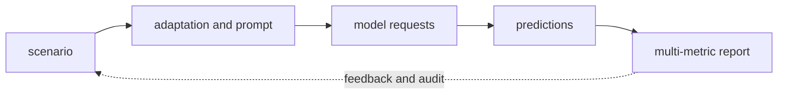

# Holistic Evaluation of Language Models - Complete Tutorial

> **Paper:** Liang et al. - arXiv:2211.09110 - [abstract](https://arxiv.org/abs/2211.09110) - [local PDF](../../papers/2211.09110.pdf)
>
> **How to use this chapter:** Tutorial 1 builds intuition without assuming computer science. Tutorial 2 is an implementation and evaluation guide. Tutorial 3 reconstructs the research claim and shows how to challenge it. The appendix teaches the prerequisites from established references.

## Paper at a glance

| Question | Paper-specific answer |
|---|---|
| Research question | How should foundation models be evaluated transparently across scenarios, metrics, and known limitations rather than by one leaderboard number? |
| What came before | Model comparisons used inconsistent prompts, datasets, metrics, and partial reporting, so results were hard to reproduce or interpret holistically. |
| Central contribution | HELM defines scenarios and adaptations, evaluates multiple metrics, and publishes standardized results and documentation in a living benchmark framework. |
| Method | A scenario specifies task and distribution; an adaptation maps it to model requests; metrics cover accuracy, calibration, robustness, fairness, bias, toxicity, and efficiency where applicable. |
| Evidence | The original study evaluates 30 prominent language models on 42 scenarios, with a core set receiving broader multi-metric analysis. It exposes trade-offs: no model dominates every scenario and metric. |
| Boundaries | Coverage is necessarily incomplete, APIs and models change, some metrics are crude proxies, and prompt/adaptation choices affect rankings. Standardization improves comparability but does not eliminate value judgments. |

The paper mattered because it changed the unit of discussion from a vague promise about language models to a concrete mechanism and evaluation. Its claim is narrower than “AI understands”: it says that under the stated data, model, prompt, and measurement conditions, the proposed intervention changes specified outcomes. Keep that sentence in view throughout all three tutorials.

## Concept map

Read the arrows as dependencies, not decoration. **scenario** supplies the starting information. **adaptation and prompt** transforms or selects it. **model requests** is the central learned or experimental mechanism. **predictions** converts internal state into a task-facing result. **multi-metric report** is what can finally be measured. The dotted feedback arrow is modern operational advice: observe failures and revise data, prompts, components, or policy. It is not necessarily part of the original experiment.

## Tutorial 1 - Intuitive understanding

Use a consumer laboratory that tests appliances on performance, energy, reliability, safety proxies, and documentation instead of declaring a winner from one speed test. The point of the analogy is not that a model thinks like a person. It separates three ideas that are easy to blur: prior material, a procedure that uses that material, and evidence that the resulting behavior improved.

### The problem in ordinary language

Model comparisons used inconsistent prompts, datasets, metrics, and partial reporting, so results were hard to reproduce or interpret holistically. The authors ask: How should foundation models be evaluated transparently across scenarios, metrics, and known limitations rather than by one leaderboard number? Their answer is HELM defines scenarios and adaptations, evaluates multiple metrics, and publishes standardized results and documentation in a living benchmark framework. This is important because it identifies an intervention one can compare, rather than treating “more intelligence” as an explanation.

Walk through one case. First comes **scenario**. Nothing downstream can recover information that was never present or accessible here. Next, **adaptation and prompt** determines what is emphasized, hidden, retrieved, assigned, or compared. Then **model requests** performs the key computation or organizational step. **predictions** is where an internal result becomes an answer, patch, action, score, or treatment. Only **multi-metric report** is directly visible to evaluation.

The analogy breaks in three places. A language model has numeric parameters rather than lived experience. A benchmark supplies a restricted scoring rule rather than ordinary human judgment. And a production system has permissions, costs, adversarial inputs, and downstream consequences absent from a tidy experiment. The analogy is a memory aid for the flow, never evidence for consciousness or correctness.

### Mechanism, step by step

1. Define the task boundary. The paper uses A broad collection of language understanding, knowledge, reasoning, generation, toxicity, bias, and disinformation scenarios normalized by the HELM framework. Decide what the system sees and what is withheld.
2. Encode or organize the input. A scenario specifies task and distribution; an adaptation maps it to model requests; metrics cover accuracy, calibration, robustness, fairness, bias, toxicity, and efficiency where applicable.
3. Apply the central rule. In compact notation: An evaluation result is indexed by model m, scenario s, adaptation a, and metric k: R[m,s,a,k], not one context-free score. The symbols are unpacked in Tutorials 2 and 3.
4. Produce an observable outcome. Preserve intermediate artifacts so a failure can be located rather than guessed.
5. Compare against a baseline under the same conditions. A baseline answers “better than what?”; without it, a score has little explanatory force.

### What the experiments show - and do not show

The original study evaluates 30 prominent language models on 42 scenarios, with a core set receiving broader multi-metric analysis. It exposes trade-offs: no model dominates every scenario and metric.

The evidence supports the paper's stated comparison, not every nearby claim. Coverage is necessarily incomplete, APIs and models change, some metrics are crude proxies, and prompt/adaptation choices affect rankings. Standardization improves comparability but does not eliminate value judgments. A useful reading therefore keeps four columns: claim, operational measure, observed comparison, and remaining alternative explanations. If a number rises, ask whether the input, data split, compute, prompt, tool access, or human population also changed.

For a nontechnical teach-back, explain the five boxes in the concept map without using the paper's acronyms. Then answer: what was changed, what was held comparable, what was measured, and what failure would still be possible after a high score? If you cannot name a failure, you have probably turned a bounded experiment into a general promise.

## Tutorial 2 - Practitioner understanding

The implementation contract is **scenario -> adaptation and prompt -> model requests -> predictions -> multi-metric report**. Treat each arrow as an interface with typed input, output, error, latency, and provenance. The paper's core mechanism is summarized by: An evaluation result is indexed by model m, scenario s, adaptation a, and metric k: R[m,s,a,k], not one context-free score. Symbols such as theta denote learned parameters; x denotes observed input; y denotes an output or target; probabilities are conditional on the information shown after the vertical bar. Paper-specific names are defined in the glossary.

### Architecture and data flow

1. Materialize **scenario** as a versioned artifact or logged event. Define its schema, owner, failure states, and acceptance check.
2. Materialize **adaptation and prompt** as a versioned artifact or logged event. Define its schema, owner, failure states, and acceptance check.
3. Materialize **model requests** as a versioned artifact or logged event. Define its schema, owner, failure states, and acceptance check.
4. Materialize **predictions** as a versioned artifact or logged event. Define its schema, owner, failure states, and acceptance check.
5. Materialize **multi-metric report** as a versioned artifact or logged event. Define its schema, owner, failure states, and acceptance check.

A scenario specifies task and distribution; an adaptation maps it to model requests; metrics cover accuracy, calibration, robustness, fairness, bias, toxicity, and efficiency where applicable. For a faithful small-scale implementation, resist substituting a modern component until the original behavior is reproduced. Pin the dataset snapshot, tokenizer or parser, model identifier, prompt/adaptation format, random seeds, decoding parameters, metric implementation, and environment image. Store raw predictions as well as aggregate scores.

The minimum observable pipeline logs a run identifier, source revision, configuration digest, input identifier, component versions, timing, output, error category, and evaluation result. Do not log secrets or unrestricted customer content. For agents or code execution, isolate the runtime and allowlist tools; for retrieval, record document identifiers and index revision; for human studies, record assignment and missingness without exposing identity.

### Evaluation, operations, and reproduction

The study's evaluation material is A broad collection of language understanding, knowledge, reasoning, generation, toxicity, bias, and disinformation scenarios normalized by the HELM framework. The headline evidence is: The original study evaluates 30 prominent language models on 42 scenarios, with a core set receiving broader multi-metric analysis. It exposes trade-offs: no model dominates every scenario and metric.

Run reproduction in four gates:

1. **Fixture gate.** Hand-check ten examples end to end. Expected result: schemas, prompts, labels, and tests agree with the paper's task definition.
2. **Baseline gate.** Reproduce the simplest reported comparator before the proposed method. Expected result: the score is directionally consistent; investigate large deviations before continuing.
3. **Intervention gate.** Change only the paper's central mechanism. Expected result: raw paired outputs are retained and the reported metric is recomputed from them.
4. **Robustness gate.** Repeat across seeds, prompt variants, subgroups, and plausible perturbations. Expected result: report a distribution and failure taxonomy, not only the best run.

Operational acceptance needs more than the paper score. Define quality, cost per accepted outcome, median and tail latency, error recovery, privacy exposure, and human override. Use a shadow deployment first. Sample failures by category, not only at random, because rare severe failures may disappear in averages. Coverage is necessarily incomplete, APIs and models change, some metrics are crude proxies, and prompt/adaptation choices affect rankings. Standardization improves comparability but does not eliminate value judgments.

### Build lab

Create a small implementation with 50-200 licensed or synthetic cases. Commit a data card, configuration, runner, raw-output directory excluded when sensitive, evaluation script, and a one-page result memo. Your result memo must distinguish faithful settings from modernization. Acceptance means another practitioner can rerun one command, obtain the same schema, and explain any score difference using recorded versions rather than speculation.

## Tutorial 3 - Researcher understanding

The formal object is not “an intelligent system”; it is a conditional mechanism or estimator operating under a design. The central expression is An evaluation result is indexed by model m, scenario s, adaptation a, and metric k: R[m,s,a,k], not one context-free score. Derive it by naming each random variable or matrix, its domain and shape, what is observed, what is learned, and what is marginalized or compared. Then identify which term encodes the paper's intervention.

For predictive papers, empirical risk is an average loss over sampled examples, and optimization chooses theta. For benchmark papers, the model may be fixed while an estimator maps outputs to a score. For causal field studies, treatment assignment and counterfactual assumptions carry the identification burden. For protocol and survey papers, the formal object is a taxonomy or compatibility relation; evidence is coverage and discriminating usefulness, not predictive accuracy.

### Experimental evidence and quantitative reconstruction

The original study evaluates 30 prominent language models on 42 scenarios, with a core set receiving broader multi-metric analysis. It exposes trade-offs: no model dominates every scenario and metric. Reconstruct this evidence from raw units before looking at the aggregate. Specify A broad collection of language understanding, knowledge, reasoning, generation, toxicity, bias, and disinformation scenarios normalized by the HELM framework. Record exclusions, missing outputs, retries, decoding samples, human adjudication, and whether observations are independent. Recreate the main table with one row per system or group and columns for configuration, compute/tool access, sample count, metric, uncertainty, and source location.

The most important comparison is the one that varies the proposed contribution while holding plausible confounders steady. A model-size comparison can confound data and compute; a retrieval comparison can confound context length; an agent comparison can confound total token budget and tool calls; a workplace comparison can confound worker selection unless treatment timing is credibly identified. These are threats to validity to test, not reasons to dismiss results automatically.

### Validity, replication, ablations, and extensions

Coverage is necessarily incomplete, APIs and models change, some metrics are crude proxies, and prompt/adaptation choices affect rankings. Standardization improves comparability but does not eliminate value judgments.

Design three ablations. First remove the proposed mechanism while preserving total budget. Second replace it with a simple alternative. Third perturb the setting where the authors' explanation predicts the largest change. State a directional hypothesis before running. Use paired examples when possible, blind human evaluators to condition, report uncertainty at the correct unit, and correct or disclose multiple comparisons.

For replication, freeze an “original-like” track and a “modern” track. The original-like track tests whether the published relationship can be recovered. The modern track tests persistence under current models, data, and tooling. Do not interpret a modern failure as proof the original result was false, or a modern success as exact replication. For extension, choose one new population or domain, one new failure-oriented metric, and one cost or safety constraint. A strong extension explains how each result would update the causal or mechanistic story.

#### Research notebook lens 1: mechanism

For **mechanism**, write the strongest claim supported by the paper, quote no prose, and point to the table, figure, equation, or design element that supplies the evidence. Next write a plausible alternative explanation and one controlled comparison that separates it. Apply this specifically to: HELM defines scenarios and adaptations, evaluates multiple metrics, and publishes standardized results and documentation in a living benchmark framework. The acceptance criterion must be observable. A negative result is informative if the manipulation, sample, and measurement had enough power to expose the predicted change. Record the paper configuration first and modernization changes second so the comparison remains interpretable.

#### Research notebook lens 2: data

For **data**, write the strongest claim supported by the paper, quote no prose, and point to the table, figure, equation, or design element that supplies the evidence. Next write a plausible alternative explanation and one controlled comparison that separates it. Apply this specifically to: HELM defines scenarios and adaptations, evaluates multiple metrics, and publishes standardized results and documentation in a living benchmark framework. The acceptance criterion must be observable. A negative result is informative if the manipulation, sample, and measurement had enough power to expose the predicted change. Record the paper configuration first and modernization changes second so the comparison remains interpretable.

#### Research notebook lens 3: evaluation

For **evaluation**, write the strongest claim supported by the paper, quote no prose, and point to the table, figure, equation, or design element that supplies the evidence. Next write a plausible alternative explanation and one controlled comparison that separates it. Apply this specifically to: HELM defines scenarios and adaptations, evaluates multiple metrics, and publishes standardized results and documentation in a living benchmark framework. The acceptance criterion must be observable. A negative result is informative if the manipulation, sample, and measurement had enough power to expose the predicted change. Record the paper configuration first and modernization changes second so the comparison remains interpretable.

#### Research notebook lens 4: systems

For **systems**, write the strongest claim supported by the paper, quote no prose, and point to the table, figure, equation, or design element that supplies the evidence. Next write a plausible alternative explanation and one controlled comparison that separates it. Apply this specifically to: HELM defines scenarios and adaptations, evaluates multiple metrics, and publishes standardized results and documentation in a living benchmark framework. The acceptance criterion must be observable. A negative result is informative if the manipulation, sample, and measurement had enough power to expose the predicted change. Record the paper configuration first and modernization changes second so the comparison remains interpretable.

#### Research notebook lens 5: human factors

For **human factors**, write the strongest claim supported by the paper, quote no prose, and point to the table, figure, equation, or design element that supplies the evidence. Next write a plausible alternative explanation and one controlled comparison that separates it. Apply this specifically to: HELM defines scenarios and adaptations, evaluates multiple metrics, and publishes standardized results and documentation in a living benchmark framework. The acceptance criterion must be observable. A negative result is informative if the manipulation, sample, and measurement had enough power to expose the predicted change. Record the paper configuration first and modernization changes second so the comparison remains interpretable.

#### Research notebook lens 6: security

For **security**, write the strongest claim supported by the paper, quote no prose, and point to the table, figure, equation, or design element that supplies the evidence. Next write a plausible alternative explanation and one controlled comparison that separates it. Apply this specifically to: HELM defines scenarios and adaptations, evaluates multiple metrics, and publishes standardized results and documentation in a living benchmark framework. The acceptance criterion must be observable. A negative result is informative if the manipulation, sample, and measurement had enough power to expose the predicted change. Record the paper configuration first and modernization changes second so the comparison remains interpretable.

## Appendix - Prerequisites

### Prerequisite 1 - Vector and matrix representations

#### Intuition and formal bridge

A vector is an ordered list of numbers; a matrix is a rectangular array that maps vectors into new representations. In language systems, a row can represent a token, document, answer choice, agent state, or measured outcome. The dot product a^T b multiplies matching coordinates and sums them. It is useful as a similarity or compatibility score, but it is not automatically a probability or explanation. If X has n rows and d features, X is in R^(n by d). Multiplying X by W in R^(d by k) yields n rows with k transformed features. Always annotate shapes: most silent implementation errors are illegal or unintended broadcasts. Rank measures how many independent directions a matrix can express; a low-rank factorization BA restricts an update to a smaller subspace. For probability vectors, nonnegative entries sum to one; softmax converts arbitrary logits z_i into exp(z_i)/sum_j exp(z_j). Numerical stability uses z_i - max(z).

#### Worked application

Start with one miniature instance and label every quantity. For this paper, use the five-stage path shown in the concept map. Write the input at stage one, the state passed between stages, the decision or transformation at each arrow, and the observed output. Then perturb one input while holding the rest fixed. This exercise turns an abstract prerequisite into a falsifiable understanding of the mechanism. Check dimensions for numeric operations, provenance for data operations, and authority for agent actions.

#### How this paper uses it

The concrete representation path is scenario -> adaptation and prompt -> model requests -> predictions -> multi-metric report. The paper's formal core can be summarized as An evaluation result is indexed by model m, scenario s, adaptation a, and metric k: R[m,s,a,k], not one context-free score. Identify which objects are vectors, matrices, scalar scores, discrete choices, or observed outcomes before manipulating the notation.

#### Common misconceptions

Do not confuse a representation with the thing represented, an optimized proxy with the real objective, correlation with intervention, an average with a guarantee, or benchmark success with deployment safety. State assumptions beside each calculation and mark any detail that the source does not establish.

**References:** Gilbert Strang, Introduction to Linear Algebra, 5th ed.; Deisenroth, Faisal, and Ong, Mathematics for Machine Learning.

### Prerequisite 2 - Gradient-based learning and objectives

#### Intuition and formal bridge

Learning chooses parameters theta to reduce an objective L(theta). A gradient is the local slope: theta_next = theta - eta grad L, where eta is a learning rate. Cross-entropy -log p_theta(y|x) penalizes low probability on the observed target. A training objective is a design contract, not the same as user value. Regularization, early stopping, validation splits, batch construction, random seeds, and optimizer state all influence the learned solution. In preference learning, the objective may contain a learned reward and a penalty that keeps the policy near a reference. In empirical studies with no model training, optimization still appears in estimation: choose coefficients minimizing residual error or maximizing a likelihood. Causal conclusions require design assumptions in addition to an optimized fit.

#### Worked application

Start with one miniature instance and label every quantity. For this paper, use the five-stage path shown in the concept map. Write the input at stage one, the state passed between stages, the decision or transformation at each arrow, and the observed output. Then perturb one input while holding the rest fixed. This exercise turns an abstract prerequisite into a falsifiable understanding of the mechanism. Check dimensions for numeric operations, provenance for data operations, and authority for agent actions.

#### How this paper uses it

For this paper, the central objective or estimator is: An evaluation result is indexed by model m, scenario s, adaptation a, and metric k: R[m,s,a,k], not one context-free score. Separate what is directly optimized from what is merely evaluated. That distinction explains why success on A broad collection of language understanding, knowledge, reasoning, generation, toxicity, bias, and disinformation scenarios normalized by the HELM framework does not by itself optimize every deployment goal.

#### Common misconceptions

Do not confuse a representation with the thing represented, an optimized proxy with the real objective, correlation with intervention, an average with a guarantee, or benchmark success with deployment safety. State assumptions beside each calculation and mark any detail that the source does not establish.

**References:** Goodfellow, Bengio, and Courville, Deep Learning; Boyd and Vandenberghe, Convex Optimization.

### Prerequisite 3 - Task and data representation

#### Intuition and formal bridge

Before computation, the task must define inputs, outputs, permissible context, and the unit of prediction. Text tokenization splits strings into vocabulary units; embeddings map identifiers to vectors; position information distinguishes order. Code repositories add files, syntax trees, imports, tests, and version history. Agent systems add messages, roles, tools, state, and termination events. Evaluation records must preserve these transformations because a change in prompt template, tokenizer, repository snapshot, or tool schema changes the task. A useful data sheet records origin, license, collection time, filtering, splits, duplicates, sensitive fields, and expected deployment differences.

#### Worked application

Start with one miniature instance and label every quantity. For this paper, use the five-stage path shown in the concept map. Write the input at stage one, the state passed between stages, the decision or transformation at each arrow, and the observed output. Then perturb one input while holding the rest fixed. This exercise turns an abstract prerequisite into a falsifiable understanding of the mechanism. Check dimensions for numeric operations, provenance for data operations, and authority for agent actions.

#### How this paper uses it

The paper operationalizes its task through A broad collection of language understanding, knowledge, reasoning, generation, toxicity, bias, and disinformation scenarios normalized by the HELM framework. Its pipeline - scenario -> adaptation and prompt -> model requests -> predictions -> multi-metric report - determines what information is available and what counts as an answer. A reproduction must preserve those boundaries before comparing scores.

#### Common misconceptions

Do not confuse a representation with the thing represented, an optimized proxy with the real objective, correlation with intervention, an average with a guarantee, or benchmark success with deployment safety. State assumptions beside each calculation and mark any detail that the source does not establish.

**References:** Jurafsky and Martin, Speech and Language Processing, 3rd-edition online draft; Kleppmann, Designing Data-Intensive Applications.

### Prerequisite 4 - Measurement and statistical uncertainty

#### Intuition and formal bridge

A metric is a measuring instrument, not the property itself. Accuracy estimates a proportion correct; pass@k estimates whether at least one of k sampled programs succeeds; latency measures time, not correctness; human preference mixes several judgments. Report the experimental unit, sample count, aggregation rule, and uncertainty. For mean m from n approximately independent units with sample standard deviation s, a rough standard error is s/sqrt(n), but paired, clustered, repeated, or adaptive observations need appropriate resampling or models. A confidence interval describes estimator behavior under assumptions; it is not the probability that a fixed parameter lies in one computed interval. Multiple comparisons and benchmark tuning can create apparently impressive results by chance.

#### Worked application

Start with one miniature instance and label every quantity. For this paper, use the five-stage path shown in the concept map. Write the input at stage one, the state passed between stages, the decision or transformation at each arrow, and the observed output. Then perturb one input while holding the rest fixed. This exercise turns an abstract prerequisite into a falsifiable understanding of the mechanism. Check dimensions for numeric operations, provenance for data operations, and authority for agent actions.

#### How this paper uses it

The reported evidence is The original study evaluates 30 prominent language models on 42 scenarios, with a core set receiving broader multi-metric analysis. It exposes trade-offs: no model dominates every scenario and metric. These measurements support a bounded comparison under the paper's design. They do not mean statistical uncertainty was measured unless the paper reports an interval, resampling method, or model. Recompute metrics at the original experimental unit and add uncertainty appropriate to dependence in the data.

#### Common misconceptions

Do not confuse a representation with the thing represented, an optimized proxy with the real objective, correlation with intervention, an average with a guarantee, or benchmark success with deployment safety. State assumptions beside each calculation and mark any detail that the source does not establish.

**References:** Wasserman, All of Statistics; Pearl, Glymour, and Jewell, Causal Inference in Statistics: A Primer.

### Prerequisite 5 - Algorithms, parallelism, and systems cost

#### Intuition and formal bridge

Complexity asks how work, memory, latency, and sequential depth scale. Big-O hides constants, hardware utilization, network calls, serialization, retries, and queueing. An LLM system should be budgeted end to end: input tokens, output tokens, retrieval, tool calls, sandbox execution, human review, storage, and failure recovery. Throughput and tail latency are different. A system that averages one second may still have a harmful 99th percentile. Reproducibility requires pinned code and data versions, immutable prompts/configuration, environment manifests, deterministic seeds where supported, logs with secret redaction, and explicit timeout/retry/idempotency behavior.

#### Worked application

Start with one miniature instance and label every quantity. For this paper, use the five-stage path shown in the concept map. Write the input at stage one, the state passed between stages, the decision or transformation at each arrow, and the observed output. Then perturb one input while holding the rest fixed. This exercise turns an abstract prerequisite into a falsifiable understanding of the mechanism. Check dimensions for numeric operations, provenance for data operations, and authority for agent actions.

#### How this paper uses it

The operational path is scenario -> adaptation and prompt -> model requests -> predictions -> multi-metric report. Profile every stage rather than attributing all cost to the language model. Preserve the paper's configuration for faithful reproduction, then separately test modern batching, caching, indexing, quantization, or parallelism.

#### Common misconceptions

Do not confuse a representation with the thing represented, an optimized proxy with the real objective, correlation with intervention, an average with a guarantee, or benchmark success with deployment safety. State assumptions beside each calculation and mark any detail that the source does not establish.

**References:** Goodfellow, Bengio, and Courville, Deep Learning; Kleppmann, Designing Data-Intensive Applications.

### Prerequisite 6 - Validity, reliability, safety, and governance

#### Intuition and formal bridge

Validity asks whether evidence supports the stated claim. Internal validity concerns confounding, leakage, implementation differences, and measurement error. External validity concerns new users, languages, domains, models, and time periods. Reliability concerns repeatability under perturbations and operational failures. Safety requires its own evidence: benchmark accuracy, regularization, open code, or a fluent explanation does not establish security, privacy, fairness, or acceptable agency. Use threat modeling, least privilege, input/output validation, human approval for consequential actions, incident logging, rollback, and periodic monitoring. NIST AI RMF separates governance, mapping, measurement, and management rather than treating one score as approval.

#### Worked application

Start with one miniature instance and label every quantity. For this paper, use the five-stage path shown in the concept map. Write the input at stage one, the state passed between stages, the decision or transformation at each arrow, and the observed output. Then perturb one input while holding the rest fixed. This exercise turns an abstract prerequisite into a falsifiable understanding of the mechanism. Check dimensions for numeric operations, provenance for data operations, and authority for agent actions.

#### How this paper uses it

The paper-specific limitations are: Coverage is necessarily incomplete, APIs and models change, some metrics are crude proxies, and prompt/adaptation choices affect rankings. Standardization improves comparability but does not eliminate value judgments. These are not erased by code release or benchmark gains. A deployment review should map users, data boundaries, failure impact, human override, access control, monitoring, and rollback before increasing autonomy.

#### Common misconceptions

Do not confuse a representation with the thing represented, an optimized proxy with the real objective, correlation with intervention, an average with a guarantee, or benchmark success with deployment safety. State assumptions beside each calculation and mark any detail that the source does not establish.

**References:** NIST AI Risk Management Framework 1.0; OWASP Top 10 for Large Language Model Applications; Wasserman, All of Statistics.

## Paper-specific glossary

- **scenario:** task plus distribution
- **adaptation:** conversion into model requests
- **metric:** rule mapping outputs to measurements
- **calibration:** agreement between confidence and correctness
- **robustness:** stability under perturbation
- **efficiency:** time or resource consumption

- **Baseline:** comparison condition used to interpret a result.
- **Ablation:** controlled removal or replacement of one component.
- **Threat to validity:** reason an observed result may support a narrower claim than stated.
- **Reproduction:** rerunning a result with substantially the same artifacts and procedure.
- **Replication:** testing the same claim with independently constructed artifacts or a changed setting.

## Source boundaries and further reading

This tutorial is a structured explanation of [Holistic Evaluation of Language Models](https://arxiv.org/abs/2211.09110) grounded in the repository's downloaded PDF. It paraphrases rather than reproduces the paper. Numerical claims should be checked against the original tables and appendices before citation, procurement, or deployment. The prerequisite lessons synthesize the named textbooks and standards; they are not claims made by the paper. Protocol behavior, model APIs, and benchmark leaderboards can change after publication, so verify current primary specifications separately.

## Checkpoint

- **Intuition:** explain the five-box map, the everyday analogy, the intervention, the headline evidence, and two things the paper does not prove.
- **Practitioner:** implement a small pipeline, reproduce a baseline and intervention, retain raw outputs, report cost/latency/failure categories, and explain every versioned dependency.
- **Researcher:** derive An evaluation result is indexed by model m, scenario s, adaptation a, and metric k: R[m,s,a,k], not one context-free score, reconstruct the main comparison, identify three threats to validity, and preregister an ablation plus an external replication with explicit acceptance criteria.
