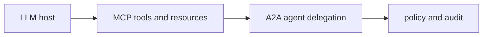

# A Survey of Agent Interoperability Protocols: MCP, ACP, A2A, and ANP

> **Paper:** Ehtesham et al. · arXiv:2505.02279 · [abstract](https://arxiv.org/abs/2505.02279) · [local PDF](../../papers/2505.02279.pdf)
>
> **Why it is here:** standard interfaces for tools, agents, and networks. Read after the preceding items in the roadmap.

## One-picture map

## Tutorial 1 — intuitive understanding

MCP is like a standardized tool socket; A2A is like a work-order language between independent service teams.

Ask three questions while reading: What problem existed before this work? What changed? What new risk or limitation appeared? Explain the diagram aloud without technical vocabulary. If you can give a familiar-life example and one counterexample, the intuition is strong enough to continue.

## Tutorial 2 — practitioner context

Use MCP for tool/resource access and A2A for delegated tasks; validate schemas, identity, authorization, consent, provenance, timeouts, and audit logs at every boundary.

### Build-and-test exercise

Create the smallest experiment that contrasts the paper's idea with a baseline. Write down the input, expected output, success metric, cost ceiling, and a failure taxonomy before running it. Keep model, prompt, data, code, and environment versions together in source control.

### Production questions

- What data crosses a trust boundary?
- What happens on timeout, malformed output, or partial failure?
- Which metric represents user value rather than benchmark convenience?
- Can a person inspect, override, and audit the result?

## Tutorial 3 — researcher depth

Compare JSON-RPC and HTTP interaction models, capability discovery, trust establishment, state machines, delegation semantics, threat models, and protocol composition.

Reconstruct one central table or figure before proposing an extension. Record the exact dataset split, statistical unit, random seeds, inference settings, uncertainty interval, and compute budget. Then change one assumption at a time. A useful research note separates **claim**, **evidence**, **assumption**, **alternative explanation**, and **next experiment**.

### Mathematical lens

Treat a model as a conditional distribution $p_\theta(y\mid x)$, an evaluation as an estimator over sampled tasks, and an agent as a policy acting on observations. Identify which variables are observed, hidden, controlled, and confounded in this paper. Use the [math bridge](../../references/math-bridge.md) whenever notation becomes the obstacle rather than the idea.

## Reading protocol

1. Read the abstract, introduction, and conclusion; write the claim in one sentence.
2. Inspect every figure and table; state what comparison each supports.
3. Read methods and evaluation; list assumptions and threats to validity.
4. Complete the exercise and add a one-page research memo.

## Checkpoint

You are ready to move on when you can teach the intuition in five minutes, implement or evaluate a toy version, and name at least two ways the main conclusion could fail to generalize.
