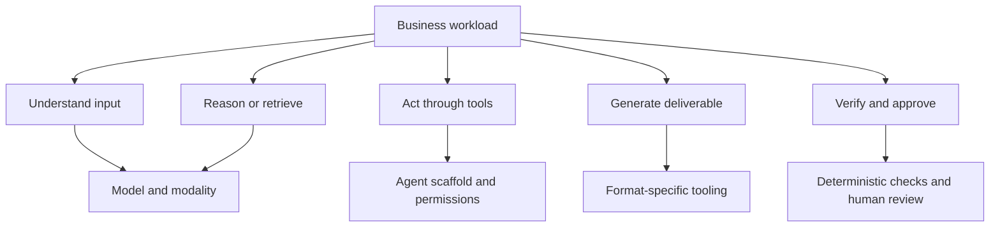
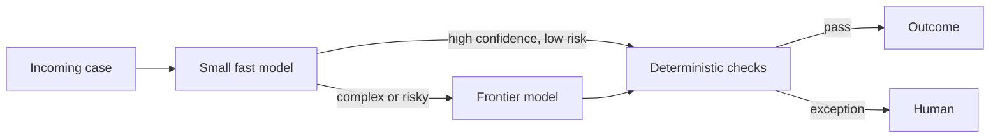

# Business workload fit

This guide produces a candidate set, not a universal winner. “Fit” means the complete system can meet a documented acceptance rule at an acceptable risk-adjusted cost.

## Workload decomposition



One model need not do every step. A small router, specialist OCR/embedding model, frontier reasoner, deterministic calculator, and human approver can be cheaper and safer than an all-purpose call.

## Use-case reference

| Business purpose | Candidate direction | Public evidence | Private acceptance gates | Primary economic unit |
|---|---|---|---|---|
| Coding and maintenance | Frontier coding/agent model; compare balanced tier and strong open-weight code model under the same scaffold | SWE-bench, Terminal-Bench, language-specific tests | Correct tests, minimal change, security, maintainability, reviewer acceptance, no unrelated edits | Cost per merged change; productive developer hours gained |
| Documentation and knowledge | Fast multimodal model for extraction; frontier model for synthesis; retrieval and citation layer | DocVQA, retrieval metrics, GDPval | Citation precision, freshness, coverage, style, permissions, abstention | Cost per approved document/answered case |
| Customer service | Fast tool model with frontier escalation | τ-bench, CRMArena | Policy adherence, resolution, escalation, PII, empathy, repeat contact | Cost per correctly resolved contact |
| CRM/sales operations | Tool-capable frontier/balanced model | CRMArena-Pro, BFCL | Correct records, authorization, opportunity policy, audit trail, no fabricated commitments | Cost per accepted completed workflow |
| General office work | Multimodal frontier model with artifact tools | GDPval, WorkArena, SpreadsheetBench | Template fidelity, correctness, editability, reviewer acceptance, time saved | Cost per accepted deliverable; productive hours gained |
| Finance analysis | Strong reasoning + retrieval + deterministic calculations | FinanceBench, FinQA, ChartQA | Current filing/source citation, recalculation, units, dates, permissions, abstention | Cost per analyst-approved answer/report |
| Legal support | High-reasoning model with controlled retrieval and matter isolation | LegalBench, CUAD, ContractNLI | Jurisdiction/current law, exact citations, privilege/confidentiality, counsel approval | Cost per counsel-approved work product |
| Personal finance and wealth | Constrained assistant with deterministic calculators and mandatory licensed review where applicable | Finance benchmarks as component tests only | Suitability, risk, eligibility, disclosures, jurisdiction, calculation, conflict, audit, privacy | Cost per compliant approved interaction—not “advice token” |
| Image production | Specialist image generator/editor; multimodal reviewer | Compositional benchmark + blinded preference | Brief adherence, text/logo, identity, rights, safety, editability, brand approval | Cost per accepted asset |
| Video production | Specialist video generator/editor | VBench 2.0 + blinded preference | Usable duration, temporal consistency, audio, rights, brand, editability | Cost per accepted usable second/clip |
| Architecture/AEC design support | Frontier multimodal reasoner + standards retrieval + deterministic engineering/CAD/BIM tools | aec-bench, AECBench, DocVQA spatial tasks | Standard edition, units, calculations, traceability, clashes, constructability, licensed approval | Cost per approved task/deliverable |
| Industry-specific workflow | Begin with general frontier and domain retrieval; consider domain fine-tune only after error analysis | Closest domain benchmark | Representative cases, regulatory gates, tool execution, expert review, incident tests | Cost per compliant accepted outcome |

## Candidate tiers to test

For each workload, test a portfolio rather than every market model:

1. **Capability ceiling:** one highest-capability hosted model to estimate attainable quality.
2. **Balanced hosted:** one or two faster/lower-cost models from a different provider when practical.
3. **Cost floor:** a small hosted model or batch tier.
4. **Control option:** an appropriately licensed open-weight model if locality, tuning, or portability has value.
5. **Human baseline:** current process time, quality, rework, and fully loaded cost.

Stop evaluating a candidate when it fails a hard safety, privacy, regulatory, or minimum-quality gate; inexpensive unsafe failures should not improve the weighted average.

## Small-business patterns

### Pattern A — high-volume triage with escalation



Best for classification, email triage, catalog enrichment, and routine support. Measure routing mistakes, escalation rate, and human exception time. The small model saves money only if it does not create expensive downstream errors.

### Pattern B — document pipeline

Use specialist OCR/layout extraction, retrieval with access controls, a reasoning model, deterministic schema/number validation, and human review of exceptions. Compare `cost per correct document` rather than OCR page price or LLM token price alone.

### Pattern C — expert copilot

Keep the expert responsible; let the system retrieve sources, propose analysis, use calculators, and draft the deliverable. Track cycle time and rework while sampling for automation bias. This is often a better first deployment for finance, legal, wealth, and engineering than an autonomous agent.

## Risk tiers

| Tier | Example | Minimum control |
|---|---|---|
| Low | Internal brainstorming, non-sensitive rewriting | Disclosure, basic data policy, sampled review |
| Moderate | Customer draft, internal analysis, code suggestion | Grounding, deterministic tests, access control, review and monitoring |
| High | Financial/legal/health guidance, production change, contractual action | Domain approval, current sources, audit trail, fail-closed policy, adversarial eval, incident process |
| Safety-critical | Engineering sign-off, high-value transaction, regulated decision | Qualified professional remains accountable; deterministic certified systems and formal assurance dominate the LLM |

## Build-or-buy and DigitalOcean note

If DigitalOcean serverless inference is the billing and access layer, evaluate the exact model IDs and prices exposed there; do not substitute the model publisher’s price or benchmark result. Serverless inference is usually the default for intermittent workloads because it avoids dedicated capacity and operations. Dedicated GPU/Gradient-style capacity becomes a candidate only when the workload requires a model not offered serverlessly, sustained throughput, custom serving/tuning, strict locality, predictable capacity, or measured break-even economics.

The platform decision record should compare:

- available versions, regions and retention terms;
- platform price and token accounting versus direct-provider price;
- rate limits, latency distribution, cold starts, batching and cache support;
- tool/function-call compatibility and observability;
- fallback portability and exit cost;
- cost per accepted outcome under the same task set.

## Decision record template

```text
Workload:
Accepted outcome:
Hard safety/data gates:
Representative sample and date range:
Human baseline (minutes, acceptance, rework, loaded cost):

Candidate systems and immutable versions:
Shared scaffold/tools/reasoning budget:
Public benchmark evidence used only for shortlisting:

Acceptance rate:
Critical-failure rate:
P50/P95 wall time:
Tokens and non-token usage per attempted/accepted outcome:
Inference + tool + platform + review + remediation cost:
Verified productive human hours gained:

Decision and confidence:
Conditions that trigger reevaluation:
Owner and review date:
```
