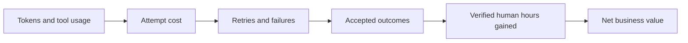

# Token-to-outcome productivity economics

## The metric hierarchy

“Cost per token per hour of productivity” combines unlike units and can hide the decision. Keep the chain explicit:



Use these complementary metrics:

1. **Unit price:** cost per input/cached/output token or media/tool unit.
2. **Token efficiency:** total billed tokens per accepted outcome.
3. **Outcome economics:** total cost per accepted outcome.
4. **Productivity economics:** operating cost and program cost per verified human hour gained.
5. **Value economics:** net value, ROI, throughput, and risk-adjusted loss.

The model with the cheapest tokens can lose at levels 2–5 because it needs more output, retries, escalation, review, or remediation.

## Define an accepted outcome first

An outcome must be observable and pass a stable rule. Examples:

| Weak denominator | Better accepted outcome |
|---|---|
| “answer” | Answer with correct calculation, current cited source, and reviewer approval |
| “code generated” | Change passes tests/security checks and is accepted in review |
| “support response” | Case resolved without policy violation or repeat contact in the defined window |
| “image” | Asset passes brief, rights/safety, brand, and production checks |
| “video second” | Usable approved second after generation, extension, editing, and review |
| “document processed” | Correct structured record with all required fields and exception policy satisfied |

Record critical failures separately. A model must not compensate for a dangerous failure with many easy successes.

## Cost ledger

For each attempt `i`, where cached input is a subset priced separately from uncached input:

```text
inference_cost_i =
    uncached_input_tokens_i * input_price_per_million / 1,000,000
  + cached_input_tokens_i   * cache_price_per_million / 1,000,000
  + output_tokens_i         * output_price_per_million / 1,000,000
  + cache_write_or_storage_i
  + media_i
  + tools_and_grounding_i

run_operating_cost = sum(inference_cost_i)
                   + platform_and_infrastructure
                   + observability

program_cost = run_operating_cost
             + human_review_cost
             + failure_remediation_cost
             + change_management_allocation
```

For self-hosting, replace API token charges with allocated accelerator, compute, memory, storage, network, idle/failover capacity, serving operations, and software cost. Still record tokens because they explain workload shape and capacity.

## Outcome metrics

```text
acceptance_rate = accepted_outcomes / attempted_outcomes

tokens_per_accepted_outcome =
  all_billed_input_cache_output_tokens / accepted_outcomes

operating_cost_per_accepted_outcome =
  run_operating_cost / accepted_outcomes

fully_loaded_cost_per_accepted_outcome =
  program_cost / accepted_outcomes

effective_throughput =
  accepted_outcomes / wall_clock_hours
```

If outcome quality varies, predefine weights or a minimum gate:

```text
quality_adjusted_outcomes = sum(quality_weight_i for accepted i)
quality_adjusted_cost = program_cost / quality_adjusted_outcomes
```

Do not invent quality weights after seeing results.

## Productivity metrics

Measure time with a paired or randomized workflow study. Self-reported “time saved” is useful for discovery but weak for an investment decision.

```text
verified_hours_gained =
  baseline_human_hours_for_same_accepted_work
  - assisted_human_hours
  - added_rework_and_coordination_hours

operating_cost_per_productive_hour_gained =
  run_operating_cost / verified_hours_gained

program_cost_per_productive_hour_gained =
  program_cost / verified_hours_gained

tokens_per_productive_hour_gained =
  all_billed_tokens / verified_hours_gained
```

Use **productive hour gained**, not merely “hour saved.” The resulting work must meet the same quality threshold, and the released time must be usable for valuable work. Also report cycle-time change and accepted outcomes per employee-hour; faster work that creates a review queue may not improve system throughput.

## Value and risk

```text
gross_value = accepted_outcomes * value_per_accepted_outcome

expected_failure_loss =
  sum(failure_probability_k * impact_k)

net_value = gross_value
          - program_cost
          - expected_failure_loss

ROI = net_value / program_cost

incremental_ROI =
  (baseline_process_cost - assisted_process_cost + incremental_value)
  / implementation_and_operating_cost
```

For high-impact workloads, show the failure distribution rather than only expected loss. Rare legal, security, financial, or engineering failures may violate a hard gate regardless of average ROI.

## Worked example — synthetic, not a market claim

A business evaluates 100 document-analysis cases. The baseline takes 20 human minutes per case at a loaded labor rate of $60/hour. Both candidates see the same documents and must pass the same reviewer rubric. These numbers are illustrative.

| Measure | Frontier workflow F | Low-price workflow L |
|---|---:|---:|
| Attempted cases | 100 | 100 |
| Average model attempts per case | 1.10 | 1.50 |
| Accepted without full redo | 92 | 80 |
| Reviewer minutes per case | 4 | 8 |
| Cases requiring full 20-minute human redo | 8 | 20 |
| API/tool operating cost for run | $3.18 | $0.97 |
| Review labor | $400 | $800 |
| Full-redo labor | $160 | $400 |
| Fully loaded run cost | $563.18 | $1,200.97 |
| Cost per initially accepted outcome | $6.12 | $15.01 |
| Baseline human time | 33.33 h | 33.33 h |
| Assisted review + redo time | 9.33 h | 20.00 h |
| Verified human hours gained | 24.00 h | 13.33 h |
| API/tool cost per productive hour gained | $0.13 | $0.07 |
| Fully loaded cost per productive hour gained | $23.47 | $90.07 |

Workflow L has cheaper inference and even lower API/tool spend per hour gained, yet its review and redo burden makes each accepted outcome and productive hour much more expensive. This is why both the operating metric and the fully loaded metric must be shown.

### Illustrative token calculation for workflow F

Assume each of its 110 attempts averages 2,000 uncached input tokens, 1,000 cached input tokens, and 800 output tokens at $4 / $0.40 / $20 per million:

```text
cost_per_attempt = 2,000*$4/1M + 1,000*$0.40/1M + 800*$20/1M
                 = $0.0244

inference_cost = 110*$0.0244 = $2.684
plus illustrative tool charges = approximately $3.18 total

tokens_per_initially_accepted_outcome =
  110*(2,000+1,000+800) / 92
  = approximately 4,543 tokens
```

Published prices alone cannot produce the table: acceptance, retries, review, and verified time come from the workload experiment.

## Evaluation experiment design

1. Draw a representative, time-bounded sample including ordinary, difficult, and high-risk cases.
2. Freeze acceptance rules and critical-failure definitions before running models.
3. Establish the human baseline with timestamps and quality review.
4. Randomize or counterbalance cases across systems; blind reviewers where possible.
5. Keep tools, retrieval corpus, scaffold, maximum budget, and retry policy comparable—or explicitly treat each combination as a separate system.
6. Record traces and usage at attempt level, including rejected and failed attempts.
7. Measure reviewer and remediation time, not just inference latency.
8. Bootstrap confidence intervals for acceptance and cost when the sample is small.
9. Run sensitivity analysis for price, volume, acceptance, labor value, utilization, and failure impact.
10. Repeat after model, prompt, tool, policy, or data distribution changes.

## Data schema

Capture one row per case per candidate:

```text
run_id, case_id, cohort, candidate, model_version, scaffold_version,
start_time, end_time, attempts, uncached_input_tokens, cached_input_tokens,
cache_write_tokens, output_tokens, tool_calls, media_units,
inference_cost, tool_cost, platform_cost, reviewer_minutes,
remediation_minutes, accepted, quality_score, critical_failure,
failure_category, baseline_minutes, productive_minutes_gained, notes
```

Aggregate only after retaining this case-level record. Averages without distributions conceal a small set of expensive or dangerous tasks.

## Dashboard views

At minimum display:

- acceptance and critical-failure rate with confidence intervals;
- tokens and cost per attempted and accepted outcome;
- P50/P90/P95 cost, latency, review time, and attempts;
- cost per verified productive hour gained;
- accepted outcomes per wall-clock and employee hour;
- failure/remediation cost by category;
- model/provider/version and price snapshot date;
- volume and price sensitivity;
- human baseline and sampling method.

## Routing economics

For a small-model-first system:

```text
route_cost = small_model_cost
           + escalation_rate * frontier_cost
           + misroute_rate * expected_misroute_loss
           + review_and_remediation
```

Optimize the routing threshold against total cost and hard risk constraints. A higher escalation rate can be economically correct when false confidence is costly.

## Practical decision rule

Choose the least expensive system that:

1. clears every hard data, safety, and critical-failure gate;
2. reaches the minimum acceptance and latency targets with adequate confidence;
3. has the lowest fully loaded cost per accepted outcome at expected volume;
4. produces positive, credible value per productive hour gained;
5. remains acceptable under adverse price, quality, utilization, and failure scenarios.
