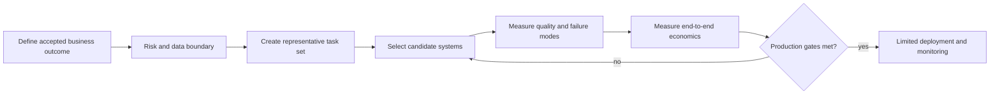

# LLM market and benchmark reference

**Snapshot date:** 2026-08-29
**Purpose:** model and evaluation selection, not a permanent leaderboard

The market changes faster than an architecture decision record. This reference therefore records dated facts, source type, access terms, and the workload evidence still needed before purchase or deployment. A model appearing here is not an endorsement.

## Read in this order

1. [Current market](01-current-market.md) — hosted frontier, specialist, image, video, and audio families.
2. [Open weights and Hugging Face](02-open-weights-and-hugging-face.md) — what is actually open, what the Hub is, and deployment economics.
3. [Benchmark catalog](03-benchmark-catalog.md) — what each benchmark measures and what it does not.
4. [Business workload fit](04-business-workload-fit.md) — shortlists and evaluation gates by business purpose.
5. [Token-to-outcome economics](05-token-to-outcome-economics.md) — cost per accepted outcome and per verified human hour saved.
6. [Evaluation scorecard](templates/workload-evaluation-scorecard.md) — a reproducible bake-off template.

Machine-readable inventories live in [`data/models.csv`](data/models.csv) and [`data/benchmarks.csv`](data/benchmarks.csv). The curated [source register](sources.md) favors vendor documentation, official model cards, benchmark repositories, and papers.

Run `node llms/market-reference/verify-reference.mjs` from the repository root to check CSV shape, local links, and unfinished placeholders.

## Interpretation rules

### Evidence classes

| Class | Meaning | Appropriate use |
|---|---|---|
| Vendor-stated | Specification, price, or result published by a model provider | Discover candidates; verify before contracting |
| Benchmark-owner | Definition or result published by the benchmark maintainer | Understand tasks and comparable runs |
| Independent | Same harness and conditions run by a neutral evaluator | Build a shortlist |
| Workload evidence | Your prompts, tools, data, reviewers, and acceptance rules | Make the deployment decision |

Never compare scores unless the model version, agent scaffold, tool access, reasoning effort, token budget, dataset version, and grading procedure match. A model score is often a score for the entire system around the model.

### Required selection gates

A public benchmark can support candidate selection. It cannot replace the representative task set, security review, human baseline, or production monitoring.

## Refresh policy

- Re-check prices and lifecycle status before every decision; prices in this snapshot are USD list prices, generally per million tokens unless stated otherwise.
- Preserve old snapshots for auditability instead of silently rewriting historical decisions.
- Record tokenizer changes because identical text can bill a different token count across model families.
- Add a model only with an official catalog/model card and a stable identifier.
- Add a benchmark only when its task, metric, dataset access, and limitations are documented.
- Re-run workload evaluations after a model alias changes, a prompt or tool changes, or acceptance policy changes.

## A compact decision principle

The lowest token price is not necessarily the lowest cost of work. Prefer the candidate with the lowest **risk-adjusted cost per accepted outcome** that meets latency, privacy, reliability, and human-review constraints. Track **cost per verified productive hour gained** separately so the business value remains visible.
