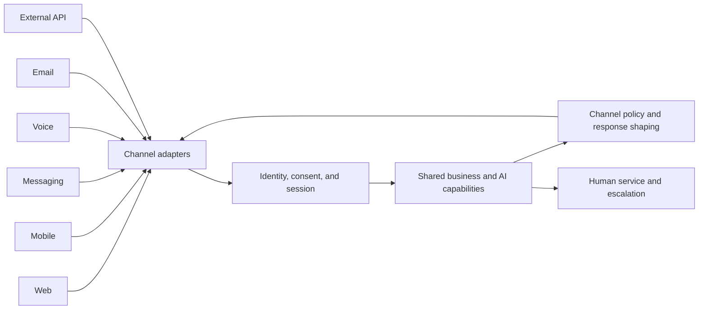

# Channels

## Outcome

Deliver consistent capabilities across web, mobile, messaging, voice, email, APIs, and assisted-service channels while respecting the constraints of each interaction surface.

## Scope

- Channel capability, audience, accessibility, language, latency, and message-format constraints.
- Identity linking, consent, session continuity, and authorization across channels.
- Channel adapters that separate business capabilities from presentation protocols.
- Notifications, inbound interactions, attachments, delivery receipts, and rate limits.
- Escalation to people and continuity between self-service and assisted service.
- Cross-channel analytics, quality monitoring, and abuse controls.

## Reference pattern

## Core deliverables

- Channel and audience matrix with supported use cases.
- Shared capability boundary and channel-adapter contracts.
- Identity, consent, and cross-channel session model.
- Content, accessibility, language, and response-time policies.
- Notification, delivery, retry, and human-handoff design.
- Channel-level service, quality, safety, and adoption measures.

## Measures

- Task completion and containment by channel.
- Delivery success, response latency, abandonment, and retry rate.
- Human handoff rate and continuity after handoff.
- Accessibility, language quality, and user satisfaction.
- Abuse, spam, authentication, and authorization failures.

## Guardrails

- Keep business rules in shared services rather than duplicating them in channel adapters.
- Re-evaluate identity and authorization when a conversation changes channel.
- Shape content for channel limits without changing the underlying policy meaning.
- Provide a visible human-escalation path for high-consequence or failed interactions.
- Collect only the channel metadata required for service, safety, and approved analytics.

## Arghyam reference material

- [Prototype channel experience](https://github.com/niyama-admin/consulting/blob/main/2026/2026-08-Arghyam-1/prototype/README.md)
- [Channel adapter implementation](https://github.com/niyama-admin/consulting/blob/main/2026/2026-08-Arghyam-1/prototype/src/channel-adapters.mjs)
