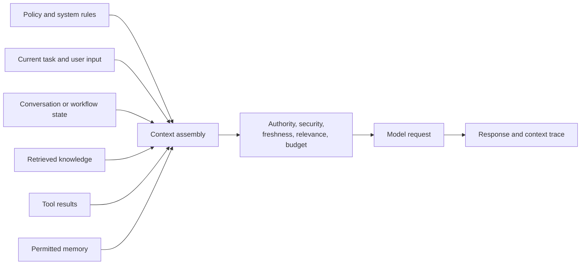

# Context Management

## Outcome

Provide an AI system with the smallest set of relevant, authoritative, permitted, and current information required to complete a task well.

## Scope

- System instructions, user intent, conversation state, retrieved knowledge, tool results, and memory.
- Context selection, prioritization, compression, ordering, and token budgeting.
- Authority, provenance, freshness, and conflict resolution between context sources.
- Security trimming based on user, role, tenant, purpose, and data classification.
- Context observability, evaluation, caching, and failure handling.

## Context hierarchy

## Core deliverables

- Context-source inventory with owners, authority, sensitivity, and freshness expectations.
- Context assembly policy and precedence rules.
- Token-budget strategy, compression rules, and overflow behavior.
- Security-trimming and redaction design.
- Context trace showing what was included, excluded, and why.
- Evaluation set for relevance, completeness, conflicts, leakage, and cost.

## Measures

- Task success and grounded-answer rate.
- Relevant-context precision and recall.
- Context-related security or privacy violations.
- Input-token cost, cache effectiveness, and response latency.
- Failures caused by stale, conflicting, missing, or excessive context.

## Guardrails

- Treat retrieved and user-supplied content as data, not trusted instructions.
- Enforce authorization before retrieval or context assembly, not after generation.
- Preserve provenance so claims and decisions can be traced to their inputs.
- Prefer authoritative and current sources over larger amounts of weak context.
- Do not use memory as a substitute for systems of record.

## Arghyam reference material

- [AI system architecture](../../../2026/2026-08-Arghyam-1/docs/ai-system-architecture.md)
- [Reference repository system context](../../../2026/2026-08-Arghyam-1/examples/agentic-engineering-reference/docs/agent-context/system-overview.md)
