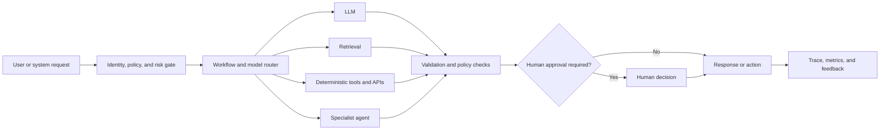

# LLM Orchestration

## Outcome

Coordinate models, deterministic services, tools, retrieval, agents, and human approvals into observable and reliable workflows.

## Scope

- Model selection and routing by task, risk, latency, quality, and cost.
- Deterministic workflows, model calls, tool use, agent delegation, and human-in-the-loop steps.
- Tool and agent contracts, including MCP- and A2A-style interoperability.
- State management, retries, timeouts, idempotency, fallbacks, and compensating actions.
- Safety policy enforcement, evaluation, tracing, and cost controls.

## Reference control flow

## Core deliverables

- Use-case decomposition identifying deterministic and probabilistic steps.
- Orchestration diagram and state-transition model.
- Model-routing policy and approved model catalogue.
- Versioned tool and agent contracts with authorization rules.
- Failure, retry, fallback, and human-escalation matrix.
- End-to-end trace schema, evaluation suite, and cost budget.

## Measures

- End-to-end task success, not only model-answer quality.
- Tool-call accuracy, retry rate, and unrecoverable failure rate.
- Latency and cost by workflow step and outcome.
- Human escalation, override, and approval rates.
- Safety-policy violations and unauthorized action attempts.

## Guardrails

- Use deterministic code for calculations, validation, authorization, and irreversible actions.
- Give each tool a narrow contract, scoped credentials, validated inputs, and auditable outputs.
- Bound loops, retries, delegation depth, token usage, and spending.
- Make workflows idempotent where duplicate execution could cause harm.
- Require human approval when uncertainty and consequence exceed the accepted risk threshold.

## Arghyam reference material

- [Agent orchestration ecosystem survey](https://github.com/niyama-admin/consulting/blob/main/2026/2026-08-Arghyam-1/docs/agent-orchestration-ecosystem-survey.md)
- [MCP and A2A demonstration guide](https://github.com/niyama-admin/consulting/blob/main/2026/2026-08-Arghyam-1/docs/mcp-a2a-demo-guide.md)
- [Prototype architecture](https://github.com/niyama-admin/consulting/blob/main/2026/2026-08-Arghyam-1/prototype/README.md)
