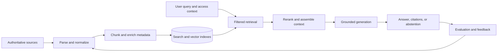

# Retrieval-Augmented Generation

## Outcome

Ground model responses in authoritative organizational knowledge with evidence that users can inspect and owners can govern.

## Scope

- Corpus selection, source authority, ownership, and content lifecycle.
- Ingestion, parsing, normalization, chunking, metadata, and indexing.
- Keyword, vector, hybrid, filtered, and reranked retrieval.
- Query transformation, context construction, citations, and abstention.
- Retrieval and answer evaluation, access control, observability, and feedback.

## Reference lifecycle

## Core deliverables

- Corpus register with authoritative sources, owners, sensitivity, and freshness rules.
- Ingestion and indexing design with deletion and re-indexing behavior.
- Metadata schema and access-control filtering model.
- Retrieval strategy and grounded-response contract.
- Representative evaluation dataset with answerable and unanswerable questions.
- Operational dashboard for freshness, retrieval quality, latency, and cost.

## Measures

- Retrieval precision, recall, ranking quality, and coverage.
- Grounded-answer correctness and citation accuracy.
- Appropriate abstention on unsupported or unauthorized questions.
- Index freshness, ingestion failure rate, latency, and cost.
- User-reported usefulness and correction rate.

## Guardrails

- Retrieve only content the requesting identity is authorized to access.
- Preserve source identity, version, and timestamp through to the response.
- Defend against instructions embedded in retrieved content.
- Support deletion, retention, correction, and re-indexing requirements.
- Require abstention or escalation when evidence is missing or contradictory.

## Arghyam reference material

- [Prototype RAG corpus](https://github.com/niyama-admin/consulting/blob/main/2026/2026-08-Arghyam-1/prototype/rag-documents/README.md)
- [Prototype implementation](https://github.com/niyama-admin/consulting/blob/main/2026/2026-08-Arghyam-1/prototype/README.md)
